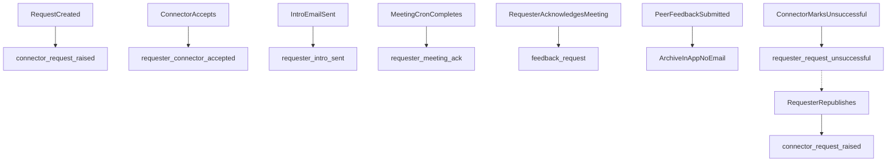

# Feature: Introduction Requests

**Version:** 1.3
**Status:** Active
**Last Updated:** 2026-06-08

## Overview
Core feature that enables users to request warm introductions to target contacts through mutual connections (connectors). Manages the full lifecycle of an introduction from initial request through acceptance, email sending, meeting scheduling, and feedback collection.

## Server Module
**Path:** `server/src/modules/introductions/`

### API Endpoints
| Method | Path | Auth | Description |
|--------|------|------|-------------|
| GET | /introduction-requests/inbox | Yes | List introduction requests received by the current user as a connector |
| GET | /introduction-requests/introduction-pipeline/stats | Yes | Aggregated stats for the user's introduction pipeline (counts by status) |
| GET | /introduction-requests/connector/pipeline | Yes | List requests where the current user is acting as a connector |
| POST | /introduction-requests | Yes | Create a new introduction request to a target contact |
| GET | /introduction-requests/:id | Yes | Retrieve a single introduction request with full details |
| PATCH | /introduction-requests/:id/accept | Yes | Accept an introduction request as a connector |
| PATCH | /introduction-requests/:id/decline | Yes | Decline an introduction request as a connector |
| POST | /introduction-requests/:id/send-intro | Yes | Send the introduction email to the target contact |
| POST | /introduction-requests/:id/schedule-meeting | Yes | Mark a meeting as scheduled for the introduction |
| POST | /introduction-requests/:id/complete | Yes | Mark the introduction as completed (meeting held) |
| POST | /introduction-requests/:id/feedback | Yes | Submit feedback for a completed introduction |

### Key Services
- **IntroductionsService** -- Manages the introduction request lifecycle, connector matching, status transitions, and pipeline queries
- **IntroductionEmailService** -- Composes and sends introduction emails via Resend, tracks delivery status, and handles retries
- **IntroductionFeedbackService** -- Collects and stores feedback from both requesters and connectors after introduction completion

### Database Tables
| Table | Purpose |
|-------|---------|
| introduction_requests | Core request records with requester, target, connector, status, bounty amount, and lifecycle timestamps |
| introduction_email_logs | Tracks all emails sent during the introduction flow including delivery status and retry attempts |
| introduction_feedback | Stores feedback ratings and comments from requesters and connectors post-completion |
| introduction_fulfillment_attempts | Records each attempt by a connector to fulfill a request, enabling multi-connector fallback |
| introduction_transactions | Financial transactions tied to introductions (bounty payments, payouts) |
| introduction_potential_connectors | Maps potential connectors for a request based on contact relationships and trust scores |
| introduction_privacy | Per-request privacy settings controlling what information is shared with connectors |

## Client
### Pages
- **IntroductionPipeline** -- `client/src/pages/IntroductionPipeline.tsx` -- Kanban-style pipeline view showing requests across all lifecycle stages
- **SendIntroduction** -- `client/src/pages/SendIntroduction.tsx` -- Form for composing and sending the introduction email to the target
- **ScheduleMeeting** -- `client/src/pages/ScheduleMeeting.tsx` -- Interface for scheduling and confirming a meeting after the introduction

### Hooks
- `useIntroductionClaim()` -- Mutation hook for a connector to claim/accept an introduction request
- `useRequesterEligibility()` -- Checks whether the current user meets requirements to make a new introduction request
- `useFeedbackRequests()` -- Fetches pending feedback requests for completed introductions
- `useMyClaims()` -- Lists introduction requests the current user has claimed as a connector

### API Module
- `client/src/lib/api/introductions.ts` -- Introduction request CRUD, status transitions, email sending, and feedback submission

## External Integrations
- **Resend** -- Transactional email service used to send introduction emails, track delivery, and handle bounces/retries

## Business Logic
- Introduction request lifecycle follows a strict state machine: `pending` -> `accepted` -> `intro_sent` -> `meeting_completed`
- When a request is created, potential connectors are identified based on contact relationships and ranked by trust score
- Multi-connector flow: if the primary connector declines, the system can fall back to the next highest-ranked potential connector
- Introduction emails are sent via Resend with tracking; delivery failures trigger automatic retries with exponential backoff
- Email logs record every send attempt, delivery status, and bounce information for audit and debugging
- Feedback is collected from both the requester and the connector after a meeting is completed; feedback scores contribute to trust score calculations
- Fulfillment attempts are tracked separately to support analytics on connector acceptance rates and response times
- Privacy settings per request allow the requester to control what personal information is shared with the connector

## Notification lifecycle

Lifecycle emails are dispatched asynchronously via a BullMQ queue (`introduction-notification`) under `server/src/modules/introductions/notifications/`. Dispatch is fire-and-forget from business services through `IntroductionNotificationsDispatchService`, which enqueues jobs via `IntroductionNotificationQueueService`. The worker (`IntroductionNotificationQueueProcessor`, registered in `server/src/worker/worker.module.ts`) renders templates and sends via the Resend Batch API.

### Notification types

| Type | Recipient | Trigger | Preconditions (processor skips if unmet) |
|------|-----------|---------|------------------------------------------|
| `connector_request_raised` | All active pending potential connectors | Request creation in `create-with-payment.service.ts` when potential-connector entries exist | Request `pending`, has `requesterId` |
| `requester_connector_accepted` | Requester | Connector accept in `introduction-potential-connectors.service.ts` (and marketplace claim in `claim-verification.service.ts`) | Request `accepted`, active requester email |
| `requester_intro_sent` | Requester | Intro email sent in `email-introduction.service.ts` | Request `intro_sent` |
| `requester_meeting_ack` | Requester | Meeting marked complete by cron in `mettings-cron.service.ts` | Request `meeting_completed`, not archived, not already acknowledged |
| `feedback_request` | Connector | Requester acknowledges meeting in `meeting-completion.service.ts` | Request `peer_feedback`, not archived, has `acceptedBy` |
| `sharer_request_claimed` | Deal sharer (referrer) | Marketplace claim completes in `claim-verification.service.ts` | Claim `completed`, has `sharerId` distinct from `claimerId`, active sharer email |
| `requester_request_unsuccessful` | Requester | Connector marks request unsuccessful in `unfulfillment.service.ts` | Active requester, latest fulfillment attempt exists; requester not archived |

### Unsuccessful connector recovery

When a connector marks a request unsuccessful (`POST /introduction-requests/:id/mark-unfulfilled`):

1. Only that connector's `introduction_potential_connectors` entry is set to `failed`
2. Request resets to `pending` (`acceptedBy` cleared); other connectors stay `archived` until the requester re-publishes
3. `introduction_requests.needs_republish` is set to `true` when at least one archived connector can still be restored (excludes connectors with prior fulfillment attempts); set to `false` when the private connector pool is exhausted
4. Refunds are processed via `RefundsService`
5. Requester receives `requester_request_unsuccessful` email (per-attempt BullMQ jobId: `intro-{requestId}-requester_request_unsuccessful-attempt-{n}`):
   - **Connectors remain** (`hasRemainingPrivateConnectors`): re-publish headline/body/CTA; deep link `action=republish`
   - **Pool exhausted**: marketplace headline/body/CTA; deep link `action=marketplace`
   - Old `action=republish` links on exhausted requests open Move to marketplace dialog with a toast (client fallback)

When the requester re-publishes (`POST /introduction-requests/:id/republish`):

1. Blocked when `needs_republish = false` or no restorable archived connectors remain (400 — move to marketplace instead)
2. Payment is re-authorized via `PaymentReauthorizationService.ensureAuthorizedForRepublish` (new transaction cycle + Stripe intents)
3. Eligible `archived` connectors are restored to `pending` (excluding connectors with prior fulfillment attempts)
4. Restored pending connectors receive `connector_request_raised` with a per-cycle BullMQ jobId (`intro-{requestId}-connector_request_raised-cycle-{n}`)
5. `needs_republish` is cleared to `false` on success
6. Connector accept is blocked while `needs_republish = true` on the request row

When all private-network connectors are exhausted (each has a fulfillment attempt, none pending, none restorable archived):

- `needs_republish = false`; pipeline shows **Move to marketplace** (not Re-publish)
- Requester manually moves to marketplace; `needs_republish` stays `false`
- **Move to marketplace is hidden** while any private connector remains `pending` or restorable `archived` (e.g. after republish with one connector still waiting to accept)

### Queue behavior

- **Idempotency**: deterministic `jobId` = `intro-{requestId}-{type}` for most lifecycle emails; `connector_request_raised` uses `intro-{requestId}-connector_request_raised-cycle-{n}`; `requester_request_unsuccessful` uses `intro-{requestId}-requester_request_unsuccessful-attempt-{n}` so repeat failures are not deduplicated
- **Retries**: queue `attempts: 1` (single attempt, no automatic re-queue); no explicit job timeout configured
- **Batching**: Resend Batch API via `sendEmailsInBatches` — 100 emails/chunk, 3s delay between chunks; connector fan-out paginated at 1000 DB rows/page
- **Deep links**: URLs built in `introduction-notification-urls.util.ts` (`review`, `acknowledge`, `feedback`, `republish` actions)
- **Close / archive**: no lifecycle email; request archived in-app when peer feedback is submitted

Note: Resend retries for the **introduction email to the prospect** (via `IntroductionEmailService`) are separate from these lifecycle notifications.

## Revision History

| Version | Date | Changes | Author |
|---------|------|---------|--------|
| 1.5.2 | 2026-06-11 | Unsuccessful email branches republish vs marketplace; marketplace deep link + republish fallback | Claude Code |
| 1.5.1 | 2026-06-11 | Hide marketplace when pending private connectors remain; per-attempt unsuccessful requester email jobId | Claude Code |
| 1.5 | 2026-06-11 | Add `needs_republish` column; exhausted pool shows marketplace; per-cycle connector_request_raised jobId | Claude Code |
| 1.4 | 2026-06-09 | Defer connector restore until requester re-publish; payment re-auth on re-publish; unsuccessful email republish CTA | Claude Code |
| 1.3.1 | 2026-06-09 | Remove in-app unsuccessful banner; fix payment re-auth to update existing payment_stages rows on accept after refund | Claude Code |
| 1.3 | 2026-06-08 | Unsuccessful connector recovery: single-connector failed status, auto-restore other connectors, requester email, payment re-auth on accept | Claude Code |
| 1.2 | 2026-06-05 | Add `sharer_request_claimed` notification for marketplace deal sharers when a claim completes | Claude Code |
| 1.1 | 2026-06-05 | Document introduction lifecycle notification system (BullMQ queue, five notification types, idempotency and batch-send behavior) | Claude Code |
| 1.0 | 2026-02-06 | Initial documentation | Claude Code |
