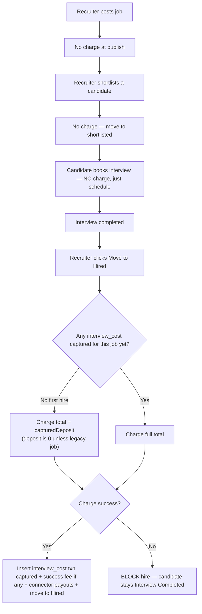

# Feature: Recruitment Flat Referral Payment

**Version:** 3.0.0
**Status:** Active
**Last Updated:** 2026-09-08

## Overview

Implements the real Stripe money movement for recruiting jobs. Flat Referral is the **only** pricing
model — the Per Interview Cost Model and all of its charge/capture branches have been removed (see
`recruitment-pricing-models.md`), so the flow below is unconditional.

A recruiter pays **one flat referral fee per candidate they actually hire**, not per
shortlist or per interview. Posting a job and shortlisting candidates are **free**; the entire fee is
charged when the recruiter moves a candidate to **Hired**. All charge amounts are computed/looked-up
server-side from `recruitment_job_prices`; no front-end value is trusted for a charge.

## Money model

For a flat fee of `$100`: `total_amount = $103.55` (flat + Stripe 2.9%+$0.30 + $0.25 app fee).

| Event | What happens |
|-------|--------------|
| Job published | Nothing charged (no Stripe call). |
| Any shortlist | **Free** — no charge, no authorization, no payment-method check. |
| Interview booked / scheduled | **Nothing charged** (only the meeting is scheduled). |
| **Move to Hired** | Charge the **full** flat fee (`$103.55`) **and**, on jobs with one, the success fee — **two separate PaymentIntents**, so the recruiter sees two line items on their card. Then create connector payouts. |
| Charge fails at hire | **Block the hire** (candidate stays in Interview Completed). |
| Candidate rejected (any time) | No refund. Any captured charge is final. |

Connector payouts are generated **at hire**
(`grossAmount = bountyAmount = flat_referral_amount`, 80/20 split, claimer/sharer split unchanged),
because the hire charge writes a standard `interview_cost` row that the payout flow already reads.

> **Charge point:** the flat referral fee (and success fee + connector payouts) is charged at **Move to
> Hired**, NOT at shortlist and NOT at interview booking. Recruiters only pay for candidates they
> actually hire. Shortlist and booking confirm perform no money movement at all.

### Two charges at hire

Hiring fires **two** independent Stripe charges (`candidate-workflow-hire.service.ts:185-186`):

| Leg | Amount | Grossed up? |
|---|---|---|
| Referral fee (`interview_cost`) | `recruitment_job_prices.total_amount`, less any legacy captured deposit on the job's first hire | **Yes** — bounty + 2.9%/$0.30 Stripe + $0.25 app fee |
| Success fee (`success_fee`) | `recruitment_job_prices.success_fee_amount` | **No** — charged raw; the platform absorbs the processing cost |

Each leg has its own idempotency, so a retry after a failed success-fee charge owes only that leg.
`ShortlistBreakdownService` therefore returns them separately (`amountDueAtHire`,
`successFeeDueAtHire`) plus `totalDueAtHire` — the figure any recruiter-facing "you will be charged"
display must use. The Hire dialog itemizes both rows and totals them, and its confirm button shows
`totalDueAtHire`.

### Legacy jobs — the retired shortlist deposit

Until v3.0.0 a one-time, job-level deposit (`flat_deposit`, ~5% of the total) was captured at the
**first shortlist** of a job. That capture has been removed; nothing is charged at shortlist any more.

Jobs that already captured a deposit keep it — it is **never refunded** — and it is still credited so
the recruiter is not double-charged: the **first** candidate of such a job to reach hire pays
`total − capturedDeposit` (e.g. `$98.37`), and every later hire pays the full `total`.

This needs no migration or backfill. `getCapturedFlatDepositAmount()` reads the **actually captured**
`flat_deposit` transaction rather than the `recruitment_job_prices.flat_deposit_amount` snapshot, so a
job with no captured deposit yields `0` and is charged the full total automatically. A job priced before
v3.0.0 that never reached a first shortlist therefore pays **100%**, even though its price row still
carries a `flat_deposit_amount` value.

## Flow chart

## Use cases

Using `total=$103.55`. Shortlisting and booking never charge — the "At Hire" column is the whole story.

### Current jobs (no deposit ever captured)

| # | Scenario | Shortlist | At Hire | Notes |
|---|----------|-----------|---------|-------|
| 1 | C1 shortlisted → booked → hired | $0 | $103.55 | Full flat fee in one charge; payout from $100 |
| 2 | …then C2 hired on the same job | $0 | $103.55 | Every hire is a full, independent charge |
| 3 | Booked but never hired | $0 | $0 | No charge unless/until hired |
| 4 | Job priced before v3.0.0, never first-shortlisted | $0 | $103.55 | Priced `flat_deposit_amount` is ignored — nothing was captured |
| 5 | Recruiter has no payment method | $0 (succeeds) | BLOCK hire | Hire is now the only card gate; UI warns before submit |
| 6 | Charge fails at Move to Hired | — | BLOCK hire | Candidate stays Interview Completed |
| 7 | Hired + charged, then rejected | — | no refund | Charge final once captured |
| 8 | Flat job WITH success fee | $0 | flat charge + success fee | Both charged at hire; both must succeed |

### Legacy jobs that captured the `$5.18` deposit before v3.0.0

| # | Scenario | At Hire | Notes |
|---|----------|---------|-------|
| 9 | First candidate of the job to reach hire | $98.37 | `total − capturedDeposit`; deposit + hire sum to $103.55 |
| 10 | A candidate shortlisted *after* v3.0.0, hired first | $98.37 | Credit follows the **first hire**, not the candidate who triggered the deposit |
| 11 | Every subsequent hire on that job | $103.55 | Only one deposit was collected, so only one hire is credited |
| 12 | Deposit captured, nobody ever hired | — | The $5.18 stays captured. Non-refundable |
| 13 | Fee raised to $120 (`total=$124.15`) before the first hire | $118.97 | The two captures still sum to the latest total |
| 14 | Fee lowered below $5.18 | $0.00 | Clamps to zero, writes a $0 `interview_cost` row, no refund |

## Server implementation

All logic branches on `recruitment_job_prices.pricing_model`.

### Transaction model
`recruitment_interview_transactions` carries a `transaction_type` discriminator. The flat model uses:
- **`flat_deposit`** (**legacy, no longer written**) — the one-time deposit captured at first shortlist
  before v3.0.0. No payout was ever generated from it. Existing rows are retained for history and for
  the hire-time credit; the partial unique index
  (`uniq_interview_txn_flat_deposit_job` on `job_id` where `transaction_type='flat_deposit'`) is kept.
- **`interview_cost`** (reused) — the **hire** charge (the full total, or the remainder on a legacy
  job's first hire). This is the row the payout flow reads, so connector payouts work unchanged.

### Key code
- **Constant:** `RECRUITMENT_INTERVIEW_TXN_TYPE.FLAT_DEPOSIT` in
  `server/src/modules/recruitment/payout/recruitment-payout.constants.ts`.
- **Schema:** partial unique index in `server/src/database/schema/recruitment-interview-transactions.ts`.
- **Shortlist:** `CandidateWorkflowShortlistService` (`candidate-workflow-shortlist.service.ts`) is a
  pure stage transition — no Stripe call, no payment-method lookup, no transaction row. The
  `CandidateWorkflowFlatDepositService` that captured the deposit was deleted in v3.0.0.
- **Deposit credit lookup:** `getCapturedFlatDepositAmount()` (`interview-cost/flat-deposit.utils.ts`)
  reads the actually-captured `flat_deposit` row for a job. Returns `0` for every job created or
  shortlisted after v3.0.0, which is what makes the hire charge the full total with no extra branching.
- **Booking confirm:** `InterviewBookingConfirmService.confirmBooking()` does **no** charge, success
  fee, or payout — it only schedules the meeting.
- **Hire charge:** `CandidateWorkflowHireService.hireCandidate()` calls, before the hire transaction:
  `InterviewBookingFlatChargeService.chargeFlatInterviewFee()`
  (`total − capturedDeposit` for the first hire on the job, else full `total`; inserts the captured
  `interview_cost` row),
  `InterviewBookingSuccessFeePaymentService.captureSuccessFeePayment()` (if a success fee is set), then
  `RecruitmentPayoutCreateService.createPayoutRecord()`. Any failure throws and blocks the hire. All three
  are idempotent. (These services are reused from the interview-booking module via module exports.)
- **Reject:** `CandidateWorkflowRejectService` is a natural no-op — it only cancels `authorized`
  `interview_cost` holds, which no longer exist (nothing is authorized at shortlist).
- **Payouts:** `RecruitmentPayoutCreateService.createPayoutRecord()` is unchanged; `bounty_amount`
  mirrors `flat_referral_amount`.

### Database tables
| Table | Role |
|-------|------|
| `recruitment_job_prices` | Source of `total_amount`. `flat_deposit_fee_percent` / `flat_deposit_amount` are legacy columns — retained but no longer written (new jobs store `NULL`) |
| `recruitment_interview_transactions` | `interview_cost` (hire charge) rows; legacy `flat_deposit` rows retained |
| `recruitment_payout_history` | Connector payout rows generated at hire |

## Recruiter visibility (Spending page)

Flat transaction types appear on the recruiter's spending view
(`/transactions?section=recruitment` → Requester Spending) and count toward the **Total Spent** stat:
- the **referral fee** row (`interview_cost`) captured at hire;
- historical **Referral Deposit** rows (`flat_deposit`) captured at first shortlist before v3.0.0 —
  still shown with a "Referral Deposit" chip in the list and a "One-time referral deposit" badge in the
  detail modal. These must keep rendering; no new ones are created.

Deposit rows stay **anonymized** (the candidate's real name/email are not revealed) because the deposit was
captured at shortlist, before identity reveal; only the hire/interview charge reveals the name. The deposit
detail has no bounty+fees breakdown (it's a single one-time amount). Implemented in the
`requester-spending` module (list / stats / detail services include `flat_deposit`).

## Security
- Every charge amount is read server-side from `recruitment_job_prices`; the client supplies nothing
  for charges (the job-create DTO only accepts `flatReferralAmount`; global `forbidNonWhitelisted`
  rejects extras).
- Job ownership is re-verified at shortlist (`requester_id === userId`).
- Double-charge guard on the hire charge: `(candidate_id, transaction_type)` unique index +
  idempotent pre-check (skips if the candidate already has an `interview_cost` row).
- The recruiter's card is validated only at hire now, so a missing/failed payment method blocks the
  hire server-side (`PAYMENT_CAPTURE_FAILED`) and is surfaced in the hire dialog before submit.
- **Known pre-existing race:** the "is this the first hire on the job" check is an unlocked read, so
  two simultaneous hires on the same *legacy* job could each take the deposit credit. Unchanged by
  v3.0.0 and only reachable on jobs that captured a deposit.

## Migration note
Removing the shortlist deposit in v3.0.0 required **no migration and no backfill**. Because the hire
charge subtracts the *actually captured* deposit (0 for every non-legacy job), simply deleting the
capture makes new jobs pay 100% and legacy jobs pay their remaining 95% automatically.

Deliberately left in place: the `uniq_interview_txn_flat_deposit_job` partial unique index, the
`flat_deposit` transaction-type constant, all existing `flat_deposit` rows, and the
`recruitment_job_prices.flat_deposit_fee_percent` / `flat_deposit_amount` columns (no longer written —
new jobs store `NULL`). No captured deposit is ever refunded.

Earlier: the `uniq_interview_txn_flat_deposit_job` index was the only schema change for v1.0.0, applied
manually outside the automated build. Removing the Per Interview Cost Model required no migration — see
`recruitment-pricing-models.md` for the columns and tables deliberately left in place.

## Revision History
| Version | Date | Changes | Author |
|---------|------|---------|--------|
| 1.0.0 | 2026-06-04 | Initial flat-referral charging: deposit at first shortlist, remainder/full at scheduling, connector payouts reused, success fee unchanged, reject no-op. | Claude |
| 1.1.0 | 2026-06-06 | Moved the flat referral fee + success fee + connector payout from interview booking to **Move to Hired**. Booking confirm now does no money for flat jobs. First hire pays remainder, later hires pay full. Recruiter UI: hire modal shows the charge; shortlist/invite/payment-card copy updated. Per-interview unchanged. | Claude |
| 1.1.1 | 2026-06-06 | Surfaced both flat transaction types (Referral Deposit + referral fee) on the recruiter Spending page and Total Spent; deposit rows kept anonymized with a "Referral Deposit" label. | Claude |
| 3.0.0 | 2026-09-08 | **Removed the 5% shortlist deposit.** Shortlisting is now free (no charge, no auth, no payment-method gate) and the full referral fee is captured at Move to Hired. Legacy jobs that already captured a deposit still credit it against the job's first hire, so they pay the remaining 95% — no migration, backfill, or refund. Deleted `CandidateWorkflowFlatDepositService`, the `flat_fees_percentages` config plumbing, and `publishFeePercent`/`chargedAtPublish`; stopped writing the two `flat_deposit_*` price columns. Moved the card gate from the shortlist dialog to the hire dialog. Historical `flat_deposit` rows still render on Spending. | Claude |
| 2.0.0 | 2026-09-02 | Removed the Per Interview Cost Model end to end. Flat Referral is the only pricing model, so all `pricing_model` branches in shortlist / booking-confirm / hire / payout are gone and the flow is unconditional. No migration: `pricing_model` and `recruitment_bounty_tiers` remain in the database, and job creation now writes `"flat_referral"` explicitly. | Claude |
