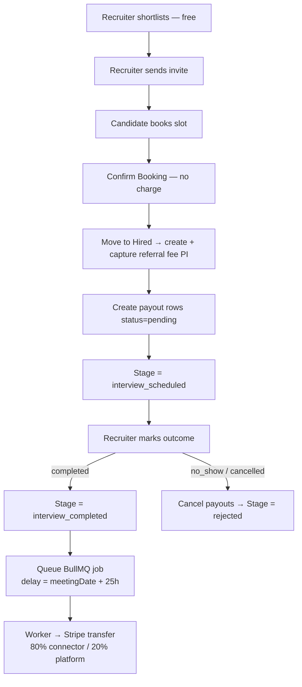
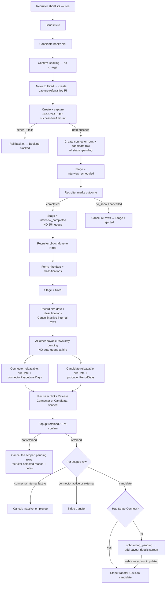
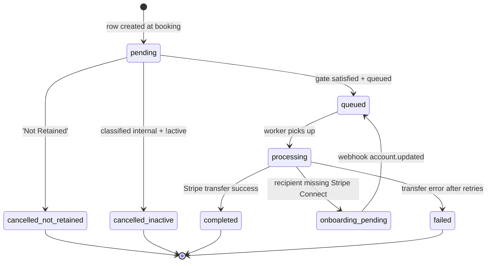

# Feature: Recruitment Success-Fee Payouts

**Version:** 1.10.0
**Status:** Active
**Last Updated:** 2026-09-10

> **Phase 7 — Repeated top-ups; release asserts funding (v1.10, 2026-09-10):** The fee could be raised **more than once** between hire and release, but only one top-up per candidate could ever be collected (`uniq_interview_txn_candidate_type`, plus an existence-based early return in each top-up service). The second raise was therefore never charged — and worse, `RecruitmentPayoutReleaseService` set the payout to the latest fee anyway while ignoring `chargeTopUpIfNeeded`'s `{charged:false}` return, so the recipient was paid at a fee the platform had not fully collected. Silently, with no error or log. Now:
>
> - **Each raise collects its own delta.** Connector funding is tracked at the fee level — `owed = max(0, total(currentFee) − (total(gross_amount@hire) + Σ captured flat_topup))`. Working in fee terms rather than summing cash keeps the legacy job-scoped `flat_deposit` out of the arithmetic, so it cannot be mis-credited. The candidate bonus already had the right shape (`latest − getFundedAmount`); it was only blocked from charging.
> - **Release never charges.** It asserts the payout is fully funded and throws `409` otherwise. The dialog refetches on failure, and when something is genuinely owed it returns to **Step 1** with an amber "The fee changed — $X more is due" note rather than an error toast. The Pay step leads with what was already collected ("You've already paid $206.44 toward this payout…") so a repeat charge doesn't read as a double charge.
> - **The worker is the last line of defence.** It now includes `flat_topup` in its funding types (previously absent — connector top-up money was verified nowhere) and compares `funded ≥ total(payout gross)`, quarantining to `manual_review` instead of transferring under-funded money. The job's legacy captured deposit is added job-wide so the check is lenient rather than falsely quarantining.
> - **Schema:** `uniq_interview_txn_candidate_type` no longer covers `flat_topup` / `success_fee_topup`; a unique partial index on `intent_id` replaces it as the double-charge guard, backed by Stripe idempotency keys now scoped to the target fee level (`…-<candidateId>-<targetTotalCents>`). `interview_cost` / `success_fee` keep their one-per-candidate guarantee. DDL only — no backfill.
> - `getFundedTopUp` → `getFundedTopUpSummary` on both services (sums captured rows, reports the latest `paidAt`, filters on `status='captured'` — the old `.limit(1)` had no status filter, so a failed row could read as funded). `connectorTopUpFunded` / `candidateTopUpFunded` now carry sums and no longer imply "nothing more is owed".
> - **The dialog shows the amount that will actually be paid.** A connector row's stored `recipient_amount` is the hire-time snapshot and is only re-priced inside the release transaction, so after paying a top-up the Send step was still showing the OLD payout. The state endpoint now previews the re-priced amount for actionable rows (`getConnectorPayoutBreakdown(currentFee, SINGLE_CONNECTOR_SHARE_PERCENT)` — the same call the write path makes, with the constant moved to `recruitment-payout.constants.ts` so read and write cannot drift). Frozen rows keep their snapshot. This also fixes the reverse case: a *lowered* fee previously showed the old higher amount while release paid the lower one. The candidate row now applies `getCandidateSuccessFeeRecipientPercent()` to the latest fee instead of using the raw gross.
> - Already-released under-collected payouts are **not** reconciled — fix-forward only.

> **Phase 6 — Release split into Pay → Send (v1.9, 2026-09-09):** Releasing used to charge the recruiter's card **and** send the payout in one request, so a card decline (e.g. insufficient funds) surfaced as a *failed payout* when nothing had been sent. The release is now **two steps in one dialog**:
>
> 1. **Pay** — collects the post-hire fee top-up **only** (new `POST /payout/:candidateId/fund`). Sends nothing. A decline keeps the dialog on this step with a plain-English reason, a Try Again action, and an explicit "nothing has been sent". No card on file is caught here too, before Stripe is ever called.
> 2. **Send** — releases the payout via the **unchanged** `POST /payout/:candidateId/release`. Its top-up call is idempotent and no-ops once funded, so the old atomic charge-then-release path still works for any caller that skips step 1.
>
> The Pay step appears **only when a top-up is actually owed**. With none owed — the common case, since most jobs never had their fee raised — the dialog renders exactly as before, in one step. The **retained** *checkbox is gone from both flows*: releasing is the default mode, a destructive **"Need to cancel this payout instead?"** link switches to the cancellation form, and **"← Back to releasing"** at the top of that form returns (the step header hides while cancelling, since cancelling exits the Pay → Send path rather than adding a step). Switching modes preserves any reason/notes already typed and only clears the submit-attempted error state. Cancelling from the Pay step collects **no charge at all**; cancelling after paying is still allowed but warns that the amount is not refunded (there is no refund path), as does switching a connector to internal + not-active. `retained` remains a required field on `ReleasePayoutDto` and is still the server's cancel-vs-release branch selector — only the checkbox control was removed.
>
> The collected top-up is durable, so reopening the dialog **resumes on the Send step** with a "Payment collected — $X · <date>" banner. That required making the read endpoint funded-aware: the connector top-up preview compared the current fee against the payout row's `grossAmount` snapshot, which is only re-synced *at release*, so after step 1 it would have kept reporting the same amount as owed. A shared `RecruitmentFlatTopupService.getFundedTopUp` (also used as the charge path's idempotency pre-check) now suppresses the preview and feeds two new response fields, `connectorTopUpFunded` / `candidateTopUpFunded`. Top-up previews were also widened to recoverable `failed` rows, matching the release service's actionable set — a retry *is* re-priced and charged, so its charge was previously invisible until it happened.
>
> Kanban cards gained an amber **"Payment collected — payout not sent yet"** badge (two new query-only flags `connectorTopUpFunded` / `candidateTopUpFunded` from a separate grouped query over `recruitment_interview_transactions`), so a half-finished release is visible without opening the dialog. The old "Charge $X & Release" `AlertDialog` is removed — the Pay step supersedes it. A legacy connector row with no saved classification skips the Pay step (it has no classification form) and falls back to the single-step release. No schema migration.

> **Phase 5 — Persistent payout buttons + read-only details view (v1.8, 2026-06-03):** The connector/candidate buttons at the Hired stage now **persist after release/cancel** and become read-only **"Connector Payout Details" / "Candidate Payout Details"** buttons (outline style); while a row is still actionable they stay the action label. New per-candidate flags `hasConnectorPayout` / `hasCandidatePayout` (`bool_or` any row) drive the persistence. Crucially, the `hasPending*` flags now use the *actionable* definition (`status='pending'` AND `processingStatus` null/`pending`), so a payout the recruiter already released — including one sitting in `onboarding_pending` because the recipient hasn't connected Stripe — no longer shows "Release"; it flips to the Details button, and the **"Awaiting Stripe Connect setup"** status (with an explanatory line) is shown **inside the modal** rather than as a card badge. `PayoutRowState` exposes `completedAt` + `updatedAt`; the `ReleasePayoutDialog` renders a read-only details view (no action controls, "Close" footer) when nothing is actionable — status pill + amount, a **Released `<date/time>`** line (`completedAt` when paid, falling back to `updatedAt` for released-but-not-yet-transferred rows so onboarding/queued/processing also show *when* it was released), and **cancellation reason + notes + cancelled date** for cancelled rows. All timestamps render in the **viewer's local timezone** (`utcDayjs(iso).local()`), not UTC. No schema migration (timestamps already existed; new flags are query-only).
>
> Job-wizard copy was also corrected to match the manual-release flow: the Connector Payout step + Confirm step no longer say connectors are "paid right away when hired" (which implied auto-payout). They now say the connector becomes **"Payable on hire"** (or **"Payable after the waiting period"**) and clarify that **you release each payout yourself from the candidate's Hired card**. The candidate success-fee copy (probation-gated) was already accurate and unchanged.

> **Phase 4 — Split Release into Connector vs Candidate actions (v1.7, 2026-06-03):** The single "Release Payout" button/dialog is split into **two independent, scoped actions** at the Hired stage: **Release Connector Payout** and **Release Candidate Bonus** (the **Edit Classification** button stays). Each releases AND cancels only its own rows — a candidate "not retained" no longer cancels connector payouts. The release endpoint takes a `scope: "connector" | "candidate"` parameter (`ReleasePayoutDto`); `RecruitmentPayoutReleaseService` filters the pending set by scope and validates the cancellation reason against the scope's set. **Connector cancel** uses a new reason set (`invalid_duplicate_referral`, `connector_unresponsive`, `policy_violation`, `other`); the candidate bonus keeps its existing reasons. `ReleasePayoutDialog` takes a `scope` prop and renders only the relevant rows/reasons/labels. No schema migration (new reason strings fit `varchar(50)`).

> **Phase 3 — Unified connector payout, no 25h window (v1.6, 2026-06-03):** Connector payout is now a **single Hire-anchored flow for every job**, fully decoupled from the success fee. The old non-success-fee path (auto-pay 25h after the meeting date, triggered by "Mark Outcome → Completed") is **removed**, and the **25-hour dispute window is gone entirely** (`RECRUITMENT_PAYOUT_DELAY_HOURS` + `queueDelayedPayout` deleted). New rules for ALL jobs:
> - Marking the interview **Completed** only advances the stage — it queues **no** payout.
> - The recruiter must **Hire** the candidate to pay connectors. **Classification is mandatory for every connector on every job.** Hire **never auto-queues** anything; it records hire-date + classifications and cancels inactive-internal rows. Every payable connector row stays `pending`.
> - **Release is manual and per-row independent.** A connector is releasable once `hire_date + connector_payout_wait_days` elapses (no waiting period ⇒ releasable immediately, but still a manual click); **no early release**. The Release action queues whatever is eligible (Stripe transfer, zero delay) and leaves the rest pending — a candidate with internal=instant + external=5-day connectors releases the instant one now and the other later.
> - Candidate success-fee row is **unchanged** (probation-gated, manual, candidate row created only when `hasSuccessFee = true`).
> - No data migration (no in-flight jobs with candidates).

> **Phase 1 — Connector Payout Decoupling (settings, 2026-06-02):** Connector payout timing has been **decoupled** from the success fee. The "When do connectors get paid?" controls were moved out of the Success Fees step into a **dedicated "Connector Payout" wizard step** (inserted between Budget and Success Fees, and read-only in the edit flow). Connectors now wait a **dedicated waiting period in days** (counted from the hire date), stored on `recruitment_job_prices.connector_payout_wait_days`, instead of reusing the candidate probation period. The two timing flags were renamed `int_payout_waits_probation`/`ext_payout_waits_probation` → `int_payout_waits_period`/`ext_payout_waits_period` and are now persisted **regardless of `hasSuccessFee`**. The candidate success fee still releases against the **probation period** (unchanged). Max waiting period 365 days; blank/0 = pay right away.

> **Phase 2 — Connector Payout Gating Rewire (v1.5, 2026-06-03):** The gating logic now actually reads `connector_payout_wait_days`. A connector row stays pending after Hire only when its `*_payout_waits_period` flag is on **and** `connector_payout_wait_days > 0`; the recruiter can release it once `hire_date + connector_payout_wait_days` has elapsed. When there is no waiting period (0/null days), the connector is **paid on hire** even if the flag is on. The candidate success-fee row is **unchanged** — still gated by `hire_date + probation_period_days`. Release stays **manual** (no scheduler/cron). A new `computeConnectorWaitWindow` helper computes the connector window; `computeProbation` continues to serve the candidate row. The `/payout/:candidateId/state` response gained `connectorPayoutWaitDays` + `connectorWaitEndsAt` so the Release dialog shows the correct date per row (connector vs candidate). No data backfill — existing jobs with no waiting period set will pay connectors on hire.


## Charge amount — raw, not grossed up

The success fee is captured at hire as a **second, separate PaymentIntent** for the raw
`recruitment_job_prices.success_fee_amount`. Unlike the referral fee it is **not** grossed up for
Stripe's 2.9% + $0.30 or the $0.25 application fee, so the platform absorbs that cost (~$70 on a
$2,000 success fee).

Because it is a distinct charge with its own idempotency, the recruiter's Hire dialog lists it as its
own line ("Success Fee") alongside the referral fee and shows the combined total — see
`recruitment-flat-referral-payment.md` ("Two charges at hire").

## Overview

> The Overview below describes the original success-fee design. As of **v1.6** the connector
> payout flow is unified for all jobs and the 25h window is removed — see the **Phase 3** banner
> at the top of this file, which supersedes the per-flow split described here.

The success fee is an opt-in **candidate** retention bonus, enabled per job when `hasSuccessFee = true` (Job Wizard Step 6):

1. A **separate Stripe PaymentIntent** for the success-fee amount is created and captured immediately at interview-booking confirmation. 100% of that fee is reserved for the candidate as a retention bonus (no platform cut). It is released manually after the **probation period** (`hire_date + probation_period_days`).
2. **Connector payout (every job, success fee or not)** is routed through the `Hired` stage. The recruiter classifies each connector as internal/external (+ active-employee for internal) when moving the candidate to Hired. Each connector is then released manually, gated by the **connector waiting period** (`hire_date + connector_payout_wait_days`), independently per row. There is **no 25-hour dispute window**.

## Locked Decisions

| # | Decision |
|---|---|
| 1 | Success fee captured via a **separate PaymentIntent** alongside bounty capture at booking. Both must succeed atomically — if either fails, booking is blocked. |
| 2 | Success fee is **candidate-only**, **100% to candidate, no platform cut**. Connectors do NOT share the success fee. |
| 3 | When `hasSuccessFee = true`, the **connector bounty also re-routes** through the new Hired-stage trigger (replaces the 25-hr post-interview-completed flow for that job). |
| 4 | New `Interview Completed → Hired` transition collects: hire date + classification of each connector (internal/external + active-employee if internal). Hired is **terminal** (no undo). |
| 5 | Step 6 wording (chosen): "Pay when the candidate is hired" vs "Pay only after the candidate completes the probation period" + scope (Both / Internal only / External only). |
| 6 | Connector classification is collected at Hired and **editable from the Hired card until that connector's row is released**. No audit log this phase. |
| 7 | At Release Payout time, the popup re-confirms internal/external + active-employee + retention. |
| 8 | "Not Retained" → no candidate bonus paid, no connector bounty paid. **No refund this phase.** |
| 9 | If connector internal but not active employee → row marked `cancelled` with reason `inactive_employee`. |
| 10 | Candidate uses the **existing Stripe Connect rail** (`payoutType = 'candidate'`). If no Connect account → row is `onboarding_pending`; existing add-payout-details screen + `account.updated` webhook re-queues. **No emails this phase.** |
| 11 | Classification is **fresh per candidate-job** (not persisted to user/org level). |
| 12 | Probation end = `hireDate + probationPeriodDays`. If `probationPeriodDays` is null/0, no wait — recruiter releases immediately. |
| 13 | All new pricing/behaviour fields are **immutable after job posting**. |
| 14 | **No notifications**, **no sweep/cron** for stale Hired, **no undo** of Hired this phase. |

## Server Module

**Paths:**
- `server/src/modules/recruitment/payout/`
- `server/src/modules/recruitment/payout-queue/`
- `server/src/modules/recruitment/candidate-workflow/`
- `server/src/modules/recruitment/interview-booking/`
- `server/src/modules/recruitment/jobs/`

### API Endpoints

| Method | Path | Auth | Description |
|--------|------|------|-------------|
| POST | `/recruitment/jobs` | Yes | Accepts new pricing fields `intPayoutWaitsPeriod`, `extPayoutWaitsPeriod`, `connectorPayoutWaitDays`. Existing endpoint. |
| POST | `/recruitment/interview-booking/:candidateId/:token/confirm` | Public token | When the job has success fees, captures the bounty PI **and** a separate success-fee PI atomically. Creates connector rows + a candidate row in `recruitment_payout_history`. |
| PATCH | `/recruitment/payout/:candidateId/interview-outcome` | Yes | Marking `completed` only advances the stage to `interview_completed` — it queues **no** payout (the 25-hr auto-pay was removed in Phase 3 / v1.6). |
| **PATCH** | **`/recruitment/candidate-workflow/:candidateId/hire`** | **Yes** | **NEW.** Move candidate Interview Completed → Hired. Body: `{ hireDate, classifications[] }`. **Records hire date + classifications and cancels inactive-internal rows only — it does NOT queue any payout** (Phase 3 / v1.6). Every payable row stays `pending`; payouts are queued later by the manual Release action. Classification is required for every connector on every job. |
| **PATCH** | **`/recruitment/candidate-workflow/:candidateId/classification`** | **Yes** | **NEW.** Edit per-connector classification on the Hired card before release. Locked once that connector's payout row is released. |
| **POST** | **`/recruitment/payout/:candidateId/fund`** | **Yes** | **NEW (Phase 6 / v1.9).** Pay step of the two-step release: `{ scope: "connector" \| "candidate" }`. Collects the post-hire fee top-up and **nothing else** — no payout is queued. Same `payout.release` permission as `/release`, throttled. Refuses when nothing is owed, when the row isn't releasable yet (no pre-funding), when the connector is unclassified, or when it is classified internal + inactive (that row is cancelled, not paid). Idempotent — a replay returns `charged: false`. |
| **POST** | **`/recruitment/payout/:candidateId/release`** | **Yes** | **NEW.** Manual release, **scoped** (Phase 4 / v1.7): `{ scope: "connector" \| "candidate", retained, classifications[], cancellationReason?, cancellationNotes? }`. Acts only on the scoped rows: retained=false cancels the scoped pending rows (with a scope-appropriate reason); retained=true queues the scoped eligible rows (per-row independent) or cancels inactive-internal. This is where payouts are actually queued for Stripe transfer. |
| **GET** | **`/recruitment/payout/:candidateId/state`** | **Yes** | **NEW (v1.2; extended v1.5).** Read endpoint feeding the Release Payout + Edit Classification dialogs. Returns connector + candidate-row payout state, plus per-row eligibility (`canReleaseNow`). v1.5 added `connectorPayoutWaitDays` + `connectorWaitEndsAt` (and renamed the flags to `intPayoutWaitsPeriod`/`extPayoutWaitsPeriod`) so the dialog shows the connector waiting-period date separately from the candidate probation date. Used to decide which connectors still need a classification form vs. which render as a read-only status pill. |

### Key Services

- **`RecruitmentPayoutCreateService`** — creates connector payout row(s) and (when applicable) the candidate success-fee row at booking confirmation. Reuses connector mapping for split decisions.
- **`InterviewBookingSuccessFeePaymentService.captureSuccessFeePayment`** *(extracted from `InterviewBookingPaymentService` for separation of failure surface)* — creates and captures the separate success-fee PI, then **inserts a NEW row** in `recruitment_interview_transactions` with `transactionType='success_fee'` and `status='captured'`. Idempotency is enforced by the `uniq_interview_txn_candidate_type` partial unique index — re-running the capture replays the same outcome rather than charging again. Lives in `services/interview-booking-success-fee-payment.service.ts`.
- **`InterviewBookingConfirmService`** — orchestrates booking. After bounty PI capture (`InterviewBookingPaymentService.captureInterviewPayment`), also calls `InterviewBookingSuccessFeePaymentService.captureSuccessFeePayment`. Failure of either rolls back the booking.
- **`RecruitmentPayoutOutcomeService`** — when `hasSuccessFee = true`, only does the stage transition for `interview_completed`. Does **not** queue the 25-hour delayed payout.
- **`CandidateWorkflowHireService`** *(new; Phase 3 / v1.6)* — Hired-transition entry point. Validates classifications cover every connector (**required for all jobs**, not just success-fee), persists `hireDate`, writes per-connector classification, and cancels `internal && !isActiveEmployee` rows with reason `inactive_employee`. **It does NOT queue any payout** — every other payable row stays `pending` and is queued later by the manual Release action. The "moved to Hired" system timestamp is captured by the stage-history insert (`recruitment_candidate_stage_history`) — no denormalized column on the candidate row.
- **`CandidateWorkflowClassificationService`** *(new)* — edits classifications on the Hired card. Rejects edits for connectors whose payout row is no longer pending.
- **`RecruitmentPayoutReleaseService`** *(new)* — manual Release Payout endpoint. Implements retained / not-retained semantics, re-confirms classification, blocks releases gated by un-elapsed probation.
- **`RecruitmentPayoutQueueProcessor`** — handles `payoutType = 'candidate'` rows transparently (`recipientAmount = successFeeAmount`, `platformAmount = 0`). The funding-source check now reads the row pointed to by `payout.interviewTransactionId` (the `success_fee` row for candidate payouts; the `bounty` row for connector payouts) and verifies its `status='captured'`. The marketplace-split reconciler is automatically skipped for candidate rows because they have `isMarketplaceDeal = false`.
- **`RecruitmentPayoutFundService`** *(new Phase 6 / v1.9)* — the Pay step. Deliberately does **not** duplicate the release service's disposition logic: it applies the hired-stage guard, reads eligibility from `RecruitmentPayoutStateService.getState()` (so its gate can never disagree with the write endpoint — both ultimately read `recruitment-payout-gating.helper.ts`), and charges through the same idempotent top-up services release calls. Cutting here is natural: `releasePayouts` already runs `Tx1 (classify, cancel inactive) → charge top-up outside any transaction → Tx2 (re-price, mark queued) → enqueue`, and step 1 is everything up to and including the charge.
- **`RecruitmentPayoutStateService`** *(new v1.2)* — read-only service feeding the Release Payout + Edit Classification dialogs. Reuses the gating helper (next bullet) so the dialog never reports `canReleaseNow=true` for a row the write endpoint would reject.
- **`recruitment-payout-gating.helper.ts`** *(new v1.2; rewired v1.5)* — shared per-row gating used by both the read endpoint (`RecruitmentPayoutStateService`) and the write endpoint (`RecruitmentPayoutReleaseService`). Two windows: `computeProbation` (candidate success-fee, `probation_period_days`) and `computeConnectorWaitWindow` *(new v1.5)* (connector payout, `connector_payout_wait_days`). `canReleaseConnectorNow(classification, flags, connectorWaitElapsed)` reads the renamed `intPayoutWaitsPeriod`/`extPayoutWaitsPeriod` flags; `canReleaseCandidateNow(probationElapsed)` is unchanged. Single source of truth for the per-row gate.

### Database Tables

| Table | Change |
|-------|--------|
| `recruitment_job_prices` | Added `int_payout_waits_probation` (boolean, default false) and `ext_payout_waits_probation` (boolean, default false). |
| `recruitment_candidate_connectors` | Added `classification_type` (varchar(20), nullable) and `is_active_employee` (boolean, nullable). Insert-only rule relaxed for these columns only. |
| `recruitment_job_candidates` | Added `hire_date` (timestamptz) — the recruiter-supplied start date that anchors the probation window. The system-clock "moved to Hired" timestamp is **not** stored on this row; it's read from `recruitment_candidate_stage_history` when needed (the stage-history insert in the Hire transaction is the authoritative log). |
| `recruitment_payout_history` | Added `cancellation_reason` (varchar(50)) — `'not_retained' \| 'inactive_employee' \| 'candidate_failed_probation' \| 'candidate_left_voluntarily' \| 'position_unavailable' \| 'performance_issues' \| 'other' \| null`. Widened from `varchar(30)` to `varchar(50)` in v1.3. Added `cancellation_notes` (varchar(500), nullable, v1.3) — free-form recruiter notes captured by the Release Payout dialog when retained=false. Reuses existing `payout_type='candidate'`. |
| `recruitment_interview_transactions` | **Polymorphic-by-row.** Added `transaction_type` (varchar(30), NOT NULL, default `'interview_cost'`) discriminator. Each fee type lives in its own row: `'interview_cost'` (recruiter-side cost of unlocking the interview — manual-capture PI funding the connector bounty + platform fees) and `'success_fee'` (separate PI captured at booking, funds the candidate retention bonus). Status, intent ID, charge amount, payment error all live on each row's own existing columns — no parallel `success_fee_*` columns. New unique partial index `uniq_interview_txn_candidate_type` on `(candidate_id, transaction_type) WHERE deleted_at IS NULL` enforces one row per fee type per candidate. New plain index on `transaction_type`. New fee types in the future are added by enum value, not by `ALTER TABLE`. |

> **Migrations are not generated automatically**; the dev runs `bunx drizzle-kit generate` after reviewing schema TS files.

### Constants Added

In `server/src/modules/recruitment/payout/recruitment-payout.constants.ts`:

```ts
RECRUITMENT_PAYOUT_CANCELLATION_REASON = {
  // Legacy / system-driven values
  NOT_RETAINED: 'not_retained',
  INACTIVE_EMPLOYEE: 'inactive_employee',
  // Recruiter-selectable from the Release Payout dropdown (v1.3)
  CANDIDATE_FAILED_PROBATION: 'candidate_failed_probation',
  CANDIDATE_LEFT_VOLUNTARILY: 'candidate_left_voluntarily',
  POSITION_UNAVAILABLE: 'position_unavailable',
  PERFORMANCE_ISSUES: 'performance_issues',
  OTHER: 'other',
}
// v1.3: recruiter-selectable subset (excludes the two system values)
RECRUITER_SELECTABLE_CANCELLATION_REASONS = [
  'candidate_failed_probation',
  'candidate_left_voluntarily',
  'position_unavailable',
  'performance_issues',
  'other',
]
RECRUITMENT_CONNECTOR_CLASSIFICATION = {
  INTERNAL: 'internal',
  EXTERNAL: 'external',
}
RECRUITMENT_INTERVIEW_TXN_TYPE = {
  INTERVIEW_COST: 'interview_cost',
  SUCCESS_FEE: 'success_fee',
  // future fees go here, no schema migration required
}
RECRUITMENT_INTERVIEW_TXN_STATUS = {
  PENDING: 'pending',
  AUTHORIZED: 'authorized',
  CAPTURED: 'captured',
  CANCELLED: 'cancelled',
  FAILED: 'failed',
}
```

## Client

### Pages

- **`PostJobWizard`** — `client/src/pages/recruitment/PostJobWizard.tsx` — wires the new Step-6 controls; derives `intPayoutWaitsProbation` / `extPayoutWaitsProbation` from `connectorPayoutTiming` + `connectorPayoutScope` on submit; populates them in edit mode.
- **`SuccessFeesStep`** — `client/src/pages/recruitment/post-job-wizard/SuccessFeesStep.tsx` — adds the "Connector Payout Timing" card with the chosen "When → Apply this rule to" wording. Shows read-only summary in edit mode.
- **`JobDetailWithKanban`** — `client/src/pages/recruitment/JobDetailWithKanban.tsx` — wires three new dialogs onto the kanban: Hire, Release, Edit-classification. Fetches the candidate's connector list via `getCandidateDetail` on demand.

### Components (new dialogs)

- `client/src/pages/recruitment/job-kanban/HireCandidateDialog.tsx` — hire-date input + per-connector classification rows. Calls `recruitmentApi.hireCandidate`.
- `client/src/pages/recruitment/job-kanban/ReleasePayoutDialog.tsx` *(rewritten v1.2)* — sources its full state from `GET /payout/:candidateId/state` (no `connectors` prop). Renders an editable classification form **only** for connectors whose payout row is still `pending`; everything else appears as a read-only status pill (see glossary below). Disables the Release button when any pending row's `canReleaseNow=false` (probation gate). When `retained=false`, shows a contextual amber warning enumerating which rows will be cancelled now and which already-paid rows will NOT be reversed. Filters `classifications[]` payload to pending entries only.
- `client/src/pages/recruitment/job-kanban/EditClassificationDialog.tsx` *(rewritten v1.2)* — same data-source refactor as Release. Renders edit fields **only** for connectors whose payout row is still pending; non-pending connectors render as read-only status pills.
- `client/src/pages/recruitment/job-kanban/PayoutFundStep.tsx` *(new v1.9 — the Pay step)*
- `client/src/pages/recruitment/job-kanban/PayoutStatusPill.tsx` *(new v1.2)* — single source of truth for the status-pill glossary (see Status Pill Glossary section below).
- `client/src/pages/recruitment/job-kanban/KanbanCandidateCard.tsx` *(updated v1.2)* — CTA visibility on the Hired stage now driven by the three new kanban payload booleans:
  - `Edit` shown only when `hasPendingConnectorPayouts === true`.
  - `Release` shown only when there is any pending row, **except** when the only pending thing is the candidate row in onboarding_pending (re-clicking Release does nothing useful in that state).
  - When `candidatePayoutOnboardingPending === true` and no other pending row exists: small slate badge `"Awaiting candidate Stripe Connect setup"` (with tooltip) instead of the Release CTA.
  - When everything is settled: `"All payouts settled"` emerald badge.

### API Module

`client/src/lib/api/recruitment.ts` — added:
- New types `ConnectorClassificationInput`, `HireCandidatePayload`, `UpdateClassificationPayload`, `ReleasePayoutPayload`, `CandidateConnectorRecord`.
- New methods `recruitmentApi.hireCandidate`, `recruitmentApi.updateCandidateClassification`, `recruitmentApi.releaseCandidatePayouts`.
- Extended `RecruitmentJobDetail`, `RecruitmentJobListItem`, `CreateRecruitmentJobPayload`, `CandidateDetailResponse` with new fields.
- *(v1.2)* Added `getCandidatePayoutState(candidateId)` method, `PayoutRowState` / `PayoutRowStatus` / `PayoutStateConnector` / `CandidatePayoutState` types. Extended `JobCandidateItem` with `hasPendingConnectorPayouts`, `hasPendingCandidatePayout`, `candidatePayoutOnboardingPending` (drive kanban CTA visibility).

### Hooks

- *(v1.2)* `client/src/hooks/useCandidatePayoutState.ts` — wraps the new endpoint with TanStack Query. Gated via `enabled` so the request only fires when a dialog actually opens.

## Status Pill Glossary (v1.2)

Single source of truth for how each payout-row status renders inside the Release Payout / Edit Classification dialogs. Implemented in `client/src/pages/recruitment/job-kanban/PayoutStatusPill.tsx`. Colours follow the project's semantic colour map.

| Row state | Pill copy | Colour |
|-----------|-----------|--------|
| `completed` | `✓ Paid $X` | Emerald (success) |
| `queued` / `processing` | `⏳ Transfer in progress` | Blue (in-progress) |
| `cancelled` + `cancellationReason='inactive_employee'` | `✖ Skipped — inactive employee` | Red (cancelled) |
| `cancelled` + `cancellationReason='not_retained'` | `✖ Cancelled — not retained` | Red (cancelled) |
| `onboarding_pending` | `• Awaiting Stripe Connect setup` | Slate (neutral) |
| `failed` | `⚠ Transfer failed` | Red (error) — no retry action this phase |
| `pending` (used in Edit dialog only when classification is missing) | `⏳ Pending` | Amber (warning) |

## Cancellation Reason Capture (v1.3)

When the recruiter unchecks the *retained* checkbox in the Release Payout dialog (cancel-all path), they are now required to:

1. Pick a **predefined reason** from a dropdown (one of `RECRUITER_SELECTABLE_CANCELLATION_REASONS`).
2. Add a **free-form note** (3–500 chars, trimmed).

Both fields are mandatory; the Confirm button performs client-side validation and the server re-validates via class-validator. The two values are persisted on every cancelled row (`cancellation_reason` + `cancellation_notes` on `recruitment_payout_history`).

**Why this matters for the connector:** the connector's Refer Candidates pipeline (`recruiting/refer-candidates`) now LEFT JOINs the connector's own payout row and surfaces `payoutStatus`, `payoutCancellationReason`, and `payoutCancellationNotes` per candidate. When `payoutStatus='cancelled'`, the connector's candidate card renders an inline destructive Alert with the friendly reason label and the recruiter's note text — so the connector knows exactly why their bounty was cancelled.

The existing `inactive_employee` auto-cancel path (system-driven, fires only inside the `retained=true` branch when a connector is classified internal + not active) is **not** affected by this change. Those rows continue to write `cancellation_notes = NULL` and render as `Skipped — inactive employee` on both surfaces.

**Single source of truth for labels:** `client/src/lib/recruitment/cancellation-reasons.ts` exports `CANCELLATION_REASON_OPTIONS` (the dropdown options) and `getCancellationReasonLabel()` (used by the recruiter status pill, recruiter dropdown, and connector card).

## External Integrations

- **Stripe** — new `StripeService.createAndCaptureNow()` helper for one-shot capture (success-fee PI). Connector bounty continues to use existing manual-capture flow + Stripe Connect transfer.

## Business Logic / Gating Matrix (v1.6)

**At Hire** (every job): record hire-date + classifications, cancel inactive-internal connector rows. **No payout is queued.** Every other payable row stays `pending`.

**At Release** (manual, per-row independent — release queues what's eligible now, leaves the rest pending):

| Row type | Releasable when | Action on Release |
|---|---|---|
| Connector (internal/external) classified inactive-internal | — | Already cancelled at Hire (`inactive_employee`); not releasable. |
| Connector, its type does NOT wait (`*_payout_waits_period = false` or `connector_payout_wait_days` 0/null) | immediately after hire | Queue Stripe transfer (zero delay). |
| Connector, its type waits (`*_payout_waits_period = true` AND `connector_payout_wait_days > 0`) | `hire_date + connector_payout_wait_days` elapsed | Queue when elapsed; otherwise stay pending (no early release). |
| Candidate (success fee) | `hire_date + probation_period_days` elapsed (immediate if 0/null) | Queue 100% to candidate when elapsed; otherwise stay pending. |

## Mermaid Diagrams

### Diagram A — Success fees DISABLED (existing flow)



### Diagram B — Success fees ENABLED (new flow)



### Diagram C — Payout-row state machine (success-fee path)



## Use Cases

- **UC-1** — Success fees disabled: existing 25-hr post-interview-completed flow, unchanged.
- **UC-2** — Success fees enabled, single internal connector, instant timing, retained: connector bounty fires at Hired; candidate bonus released after probation.
- **UC-3** — Split connectors with mixed instant/probation: Alice (internal-instant) fires at Hired; Bob (external-after-probation) waits.
- **UC-4** — Connector internal + not active: row cancelled `inactive_employee`. Money stays with platform.
- **UC-5** — Recruiter selects "Not Retained" at release: all pending rows cancelled `not_retained`. No money moves. No refund this phase.
- **UC-6** — Candidate without Stripe Connect: row goes `onboarding_pending`; existing webhook handler re-queues when they onboard.
- **UC-7** — Recruiter card declines on success-fee PI: booking transaction rolls back; no rows created.
- **UC-8** — `probationPeriodDays` null/0 with success fees enabled: candidate row + gated connectors can be released immediately on Hired.
- **UC-9** — Recruiter edits classification before release: allowed **only for connectors whose payout row is still pending**. The Edit dialog shows already-handled connectors as read-only status pills; the backend rejects edits for non-pending rows. Updates trigger re-evaluation of gating on the next release click.
- **UC-10** — Recruiter never moves to Hired: success fee stays with platform indefinitely (out of scope this phase).
- **UC-11** — Hire transition with missing/invalid classifications: rejected `400`.
- **UC-12** — Same connector, two jobs, two different classifications: allowed (per-`recruitment_candidate_connectors` row).
- **UC-13** *(v1.2)* — **Release dialog after instant-on-hire payouts.** Both connectors are paid at Hire (no probation wait). Recruiter clicks Release Payout → dialog shows the two connectors as `✓ Paid $X` rows (no classification form), the candidate-bonus row as the only actionable item, and the Release button releases just the candidate bonus. After confirm, the kanban card hides the Release CTA and shows the `All payouts settled` badge.
- **UC-14** *(v1.2)* — **Onboarding-pending candidate row.** Recruiter previously clicked Release; candidate had no Stripe Connect, so the row is in `processingStatus='onboarding_pending'`. The kanban card hides the Release CTA and shows a slate `Awaiting candidate Stripe Connect setup` badge. The system re-queues the transfer automatically when the `account.updated` webhook fires (no further recruiter action).

## Edge Cases

- Existing `no_show / cancelled` outcome path correctly cancels candidate row (uses non-deleted filter, hits all rows for the candidate).
- Connector deleted between Hired and release — connector bounty path runs the existing sharer-deleted reconciler; success-fee candidate row is unaffected (`isMarketplaceDeal=false`).
- Two recruiters on the same job — only the job owner (`requester_id`) can move to Hired or release payouts.
- Currency — USD only (existing system constraint). Success fee inherits the same currency.
- Idempotency — unique index `(candidateId, jobId, recipientId)` on `recruitment_payout_history` already prevents duplicates; candidate's `recipientId` is distinct from connectors so candidate rows don't collide.

## File Touchpoints

**Server:**
- `server/src/database/schema/recruitment-job-pricing.ts`
- `server/src/database/schema/recruitment-candidate-connectors.ts`
- `server/src/database/schema/recruitment-job-candidates.ts`
- `server/src/database/schema/recruitment-payout-history.ts`
- `server/src/database/schema/recruitment-interview-transactions.ts`
- `server/src/modules/recruitment/jobs/recruitment-jobs.dto.ts`
- `server/src/modules/recruitment/jobs/services/recruitment-jobs-mutation.service.ts`
- `server/src/modules/recruitment/jobs/services/recruitment-jobs-query.service.ts`
- `server/src/modules/recruitment/interview-booking/services/interview-booking-confirm.service.ts`
- `server/src/modules/recruitment/interview-booking/services/interview-booking-payment.service.ts`
- `server/src/modules/recruitment/payout/services/recruitment-payout-create.service.ts`
- `server/src/modules/recruitment/payout/services/recruitment-payout-outcome.service.ts`
- `server/src/modules/recruitment/payout/services/recruitment-payout-release.service.ts` *(new)*
- `server/src/modules/recruitment/payout/recruitment-payout.constants.ts`
- `server/src/modules/recruitment/fee-config/recruitment-fee-config.service.ts` — owns the `100/0` candidate-success-fee split (read via `getCandidateSuccessFeeRecipientPercent()` / `getCandidateSuccessFeePlatformPercent()`)
- `server/src/modules/recruitment/payout/recruitment-payout.dto.ts`
- `server/src/modules/recruitment/payout/recruitment-payout.controller.ts`
- `server/src/modules/recruitment/payout/recruitment-payout.module.ts`
- `server/src/modules/recruitment/candidate-workflow/services/candidate-workflow-hire.service.ts` *(new)*
- `server/src/modules/recruitment/candidate-workflow/services/candidate-workflow-classification.service.ts` *(new)*
- `server/src/modules/recruitment/candidate-workflow/candidate-workflow.controller.ts`
- `server/src/modules/recruitment/candidate-workflow/candidate-workflow.dto.ts`
- `server/src/modules/recruitment/candidate-workflow/candidate-workflow.constants.ts`
- `server/src/modules/recruitment/candidate-workflow/candidate-workflow.module.ts`
- `server/src/modules/recruitment/candidates/services/candidates-query.service.ts`
- `server/src/modules/recruitment/payout-queue/services/recruitment-payout-queue.processor.ts`
- `server/src/modules/recruitment/payout/services/recruitment-payout-fund.service.ts` *(new v1.9)*
- `server/src/modules/recruitment/payout/services/recruitment-flat-topup.service.ts` — shared `getFundedTopUp`
- `server/src/modules/recruitment/payout/services/recruitment-success-fee-topup.service.ts` — shared `getFundedTopUp`
- `server/src/modules/recruitment/candidates/services/candidates-list.service.ts` — the two funded-top-up kanban flags
- `server/src/modules/recruitment/payout/services/recruitment-payout-state.service.ts` *(new v1.2)*
- `server/src/modules/recruitment/payout/services/recruitment-payout-gating.helper.ts` *(new v1.2)*
- `server/src/modules/recruitment/payout/recruitment-payout.response.ts` *(new v1.2)*
- `server/src/modules/stripe/stripe.service.ts`

**Client:**
- `client/src/pages/recruitment/post-job-wizard/SuccessFeesStep.tsx`
- `client/src/pages/recruitment/post-job-wizard/types.ts`
- `client/src/pages/recruitment/post-job-wizard/wizard-step-schemas.ts`
- `client/src/pages/recruitment/PostJobWizard.tsx`
- `client/src/pages/recruitment/JobDetailWithKanban.tsx`
- `client/src/pages/recruitment/job-kanban/KanbanCandidateCard.tsx`
- `client/src/pages/recruitment/job-kanban/HireCandidateDialog.tsx` *(new)*
- `client/src/pages/recruitment/job-kanban/ReleasePayoutDialog.tsx` *(new — rewritten v1.2)*
- `client/src/pages/recruitment/job-kanban/EditClassificationDialog.tsx` *(new — rewritten v1.2)*
- `client/src/pages/recruitment/job-kanban/PayoutStatusPill.tsx` *(new v1.2)*
- `client/src/pages/recruitment/job-kanban/types.ts`
- `client/src/hooks/useCandidatePayoutState.ts` *(new v1.2)*
- `client/src/lib/api/recruitment.ts`

## Out of Scope (Phase 2)

- Refunds for success fee on terminate-before-probation / never-hired.
- Sweep / auto-release for stale Hired or stale interview-completed.
- Notifications and emails (recruiter, candidate, connector).
- Audit log for classification edits.
- Undo of Hired transition.
- Per-job custom commission % for success-fee connector portion.
- Multi-currency support.
- Candidate-side dashboard "Action required: add payout details" badge (data is available; UI not yet added).
- Cancellation-reason badges in a recruitment payout history UI (no recruitment-specific payout history UI exists yet; data is available).
- **Surface success-fee rows in the recruiter Spending UI.** Today, `spending-list`, `spending-detail`, and `spending-stats` are scoped to `transactionType='interview_cost'` to preserve existing 1:1 totals/line-items. Phase 2 should extend the recruiter spending UI to display success-fee rows as their own line items (e.g., a "Type" column) and make stats include both — so the recruiter sees a full breakdown of what they paid (interview cost + success-fee), each linked to its own captured PI / receipt URL.
- **Retry path for `failed` connector payouts.** v1.2 surfaces the `⚠ Transfer failed` pill in the Release / Edit dialogs but provides no in-product retry action. Add a `POST /payout/:payoutId/retry` endpoint and a retry button in the dialog so the recruiter can re-trigger Stripe transfers without engineering intervention.

## Revision History

| Version | Date | Changes | Author |
|---------|------|---------|--------|
| 1.0 | 2026-04-29 | Initial documentation | Claude (with Pdalal@officebeacon.com) |
| 1.1 | 2026-04-30 | Refactored success-fee storage: row-per-fee-type with `transaction_type` discriminator on `recruitment_interview_transactions`, replacing the original column-extension approach. Mirrors `payoutType` pattern on `recruitment_payout_history`. Future fee types add by enum, not by `ALTER TABLE`. | Claude (with Pdalal@officebeacon.com) |
| 1.2 | 2026-05-01 | Per-connector skip rule for Release / Edit dialogs: only render classification form for connectors whose payout row is still `pending`; everything else renders as a read-only status pill. New `GET /payout/:candidateId/state` endpoint feeds both dialogs. New `RecruitmentPayoutStateService`, shared `recruitment-payout-gating.helper.ts`, kanban payload extended with three CTA-visibility booleans (`hasPendingConnectorPayouts`, `hasPendingCandidatePayout`, `candidatePayoutOnboardingPending`). New `PayoutStatusPill` component + glossary section. Contextual not-retained warning enumerates already-paid rows. Failed connector rows surface a status pill (no retry action — Phase 2). | Claude (with Pdalal@officebeacon.com) |
| 1.2.1 | 2026-05-01 | Hotfix: tightened `RecruitmentPayoutReleaseService.releasePayouts` actionable-row filter to `status='pending' AND processingStatus IN (NULL, 'pending')`. Previously, an instant-on-hire connector whose row was already queued (lifecycle `status='pending'`, `processingStatus='queued'`) was incorrectly included in the pending set, causing a 400 `"Classification missing for one or more connectors"` on mixed instant + after-probation jobs. Aligns the server with the dialog's display-status rule. Also narrowed the `retained=false` cancel-all UPDATE to the same actionable set so a mid-flight Stripe transfer can't be cancelled out from under the worker. | Claude (with Pdalal@officebeacon.com) |
| 1.3.0 | 2026-05-07 | Cancellation reason capture on the Release Payout dialog. When the recruiter unchecks `retained`, the dialog now requires a dropdown reason (`candidate_failed_probation`, `candidate_left_voluntarily`, `position_unavailable`, `performance_issues`, `other`) and a 3–500 char free-form note; both are persisted on every cancelled row. Schema: added `cancellation_notes` (varchar(500)) and widened `cancellation_reason` from varchar(30) → varchar(50) on `recruitment_payout_history`. Server: `ReleasePayoutDto` enforces both fields with `@ValidateIf(retained === false)`; `RECRUITER_SELECTABLE_CANCELLATION_REASONS` constant added; `RecruitmentPayoutReleaseService.releasePayouts` writes the recruiter-supplied reason + notes instead of the hardcoded `not_retained`. The connector pipeline (`/recruitment/connector-pipeline`) now LEFT JOINs `recruitment_payout_history` filtered by `recipient_id=current connector` so the connector sees `payoutStatus`, `payoutCancellationReason`, `payoutCancellationNotes` per candidate. Client: shared `cancellation-reasons.ts` label map; new dropdown + textarea section in `ReleasePayoutDialog`; new inline destructive Alert on `ConnectorKanbanCard` when payout is cancelled. The `inactive_employee` auto-cancel path is unchanged (still writes `cancellation_notes=NULL`). Migration is hand-written by the user. | Claude (with Pdalal@officebeacon.com) |
| 1.10.0 | 2026-09-10 | **Phase 7 — Repeated top-ups; release asserts funding.** See the Phase 7 banner. Server: `computeTopUp` takes `candidateId` and nets off `sumCapturedTopUps`; both top-up services drop the existence early-return and key Stripe on the target fee level; `getFundedTopUpSummary` replaces `getFundedTopUp`; `RecruitmentPayoutReleaseService` throws `409` instead of charging; the queue processor adds `FLAT_TOPUP` to its funding types and compares amounts (injecting `FlatReferralFeeService` via `InterviewCostModule`); `candidates-detail.service` sums top-ups. Client: `payStepAmount` follows the owed figure rather than the funded one, `mutation.onError` refetches and bounces to Step 1 when something is owed, and `PayoutPayStep` gained `alreadyPaid` + `feeChangedNotice`. Schema: two index changes, no backfill. | Claude |
| 1.9.1 | 2026-09-09 | **Retained checkbox replaced by an explicit two-way mode switch.** The checkbox that flipped the dialog into cancellation mode is removed from both the two-step and single-step flows (it changed the primary action, and once unchecked in the stepped flow there was no signposted way back). Release is the default; a destructive `CancelPayoutLink` switches to the cancellation form and a muted `BackToReleaseLink` returns. New `job-kanban/PayoutModeLink.tsx` holds both so `PayoutPayStep` and the normal body share one implementation; `SCOPE_CONFIG.retainedPrompt` and `renderRetainedCheckbox` are deleted, and the two body helpers now take `onSwitchToCancel` / `onSwitchToRelease` instead of `setRetained`. A `switchMode` handler clears only `showCancelErrors`, keeping typed reason/notes. No server or payload change — `retained` is still sent. | Claude |
| 1.9.0 | 2026-09-09 | **Phase 6 — Release split into Pay → Send.** New `POST /payout/:candidateId/fund` collects the post-hire fee top-up as its own step so a declined card reports a declined card instead of a failed payout; `/release` is **unchanged** (its top-up call is idempotent and no-ops once funded, keeping the old atomic path valid). Server: new `RecruitmentPayoutFundService` (reads eligibility from `RecruitmentPayoutStateService.getState()`, charges via the existing top-up services); new shared `getFundedTopUp` on both top-up services (also now the charge path's idempotency pre-check); state service is funded-aware and returns `connectorTopUpFunded` / `candidateTopUpFunded` (new `PayoutTopUpFunded` type) — required for the resume-on-Send behaviour, since the connector preview compares against a `grossAmount` snapshot that is only re-synced at release; both top-up previews widened to recoverable `failed` rows to match the release service's actionable set; `candidates-list.service` adds two funded-top-up flags via a separate grouped query. Client: new `PayoutFundStep`; `ReleasePayoutDialog` gains a two-step model (`WizardStepRail`, horizontal) shown only when a charge is owed, a "Payment collected" banner on Send, not-refunded warnings, a no-card-on-file gate via `usePrimaryPaymentMethod`, and scoped query invalidation; the superseded "Charge $X & Release" `AlertDialog` and its amber banner are removed; `KanbanCandidateCard` shows an amber "Payment collected — payout not sent yet" badge. Top-up failure copy reworded to say nothing was sent. No migration. | Claude |
| 1.8.0 | 2026-06-03 | **Phase 5 — Persistent payout buttons + read-only details view.** The Hired-stage connector/candidate buttons now persist after release or cancel and relabel to "Connector Payout Details" / "Candidate Payout Details" (outline), opening `ReleasePayoutDialog` in a read-only mode (no action controls, "Close" footer) showing status + amount, a "Released &lt;date/time&gt;" line, and cancellation reason + notes + cancelled date for cancelled rows. The `hasPending*` flags were tightened to the *actionable* definition (`status='pending'` AND `processingStatus` null/`pending`) so an already-released row (incl. `onboarding_pending` when the recipient hasn't connected Stripe) no longer shows "Release" — it flips to the Details button and the awaiting-Stripe/in-progress status shows inside the modal (the card-level onboarding badge was removed). The "Released" date uses `completedAt` when paid, falling back to `updatedAt` for released-but-not-yet-transferred rows, and all timestamps render in the viewer's local timezone (`.local()`). Server: `candidates-list.service` adds `hasConnectorPayout` / `hasCandidatePayout` (`bool_or` any row) and tightens the pending flags; `PayoutRowState` (+ state service) exposes `completedAt` + `updatedAt`; response `RecruitmentPayoutCancellationReason` union extended with the connector reasons. Client: `JobCandidateItem` / `KanbanCandidate` carry the two new flags; `KanbanCandidateCard` shows persistent action/details buttons (dropped the "All payouts settled" badge); `ReleasePayoutDialog` adds `isViewMode` + `PayoutRowDetail`. No migration. | Claude (with Pdalal@officebeacon.com) |
| 1.7.0 | 2026-06-03 | **Phase 4 — Split Release into separate Connector and Candidate actions.** Added `scope: "connector" \| "candidate"` to `ReleasePayoutDto`; `RecruitmentPayoutReleaseService` filters the pending set by scope, cancels/releases only the scoped rows, and validates the cancellation reason against the scope's set. New connector reason constants + `RECRUITER_SELECTABLE_CONNECTOR_CANCELLATION_REASONS` (`invalid_duplicate_referral`, `connector_unresponsive`, `policy_violation`, `other`); candidate reasons unchanged. Client: `ReleasePayoutDialog` gained a `scope` prop (renders only the relevant rows/reasons/labels via `SCOPE_CONFIG`); `KanbanCandidateCard` now shows two buttons — "Release Connector" + "Release Candidate Bonus" — plus the unchanged Edit Classification; `JobDetailWithKanban` tracks scope in the release-dialog state. `cancellation-reasons.ts` adds `CONNECTOR_CANCELLATION_REASON_OPTIONS` and the label map covers connector reasons. No migration (reason strings fit `varchar(50)`). | Claude (with Pdalal@officebeacon.com) |
| 1.6.0 | 2026-06-03 | **Phase 3 — Unified connector payout; 25h dispute window removed.** Connector payout is now one Hire-anchored flow for every job, decoupled from `hasSuccessFee`. Removed the non-success-fee Interview-Completed auto-pay and the 25h window: deleted `RECRUITMENT_PAYOUT_DELAY_HOURS` + `RecruitmentPayoutOutcomeService.queueDelayedPayout` (marking Completed now only advances the stage). Hire (`CandidateWorkflowHireService`) now requires classification for every connector on every job, no longer reads pricing/wait flags, and **queues nothing** — it records hire-date + classifications and cancels inactive-internal rows only. Release (`RecruitmentPayoutReleaseService`) is **per-row independent**: eligible rows queue (zero delay), gated rows stay pending (no 400, returns `stillPending`); connector gate = `hire_date + connector_payout_wait_days`, candidate gate = probation. Client: removed the `hasSuccessFee` prop/gating from `KanbanCandidateCard`, `HireCandidateDialog`, `ReleasePayoutDialog`, `EditClassificationDialog`, `JobDetailWithKanban`; classification UI + Hire/Release CTAs now show for all jobs; Release button enabled when ≥1 row is releasable now (`hasReleasableNow`). No data migration. | Claude (with Pdalal@officebeacon.com) |
| 1.5.0 | 2026-06-03 | **Phase 2 — Connector payout gating rewired to the waiting period.** Connector rows now gate on `hire_date + connector_payout_wait_days` instead of probation; a row stays pending after Hire only when its `*_payout_waits_period` flag is on AND `connector_payout_wait_days > 0` (0/null ⇒ paid on hire). The candidate success-fee row is unchanged (still `probation_period_days`). Release stays manual (no scheduler). Server: new `computeConnectorWaitWindow` helper; `canReleaseConnectorNow` + the hire/release/state services now consume the connector wait window and the renamed `intPayoutWaitsPeriod`/`extPayoutWaitsPeriod` flags; connector release error reworded to "Waiting period has not elapsed…". Response (`recruitment-payout.response.ts`) + client `CandidatePayoutState` gained `connectorPayoutWaitDays` + `connectorWaitEndsAt`. `ReleasePayoutDialog` shows the connector waiting-period date vs the candidate probation date per blocked row (`getReleaseBlockerMessage`). Client UI literal `connectorPayoutTiming: "after_probation"` → `"after_period"`. No data backfill. | Claude (with Pdalal@officebeacon.com) |
| 1.2.2 | 2026-05-01 | Two hide-classification-when-not-applicable fixes + a rename + a denormalization rollback. (a) Hide per-connector classification UI in the Hire / Release / Edit dialogs and hide the manual Edit/Release CTAs on the Hired card when the job has `hasSuccessFee=false` — classification is a success-fee-only concept. Server: `HireCandidateDto.classifications` now allows empty array; hire service skips classification validation/persistence when `hasSuccessFee=false`. Client: `hasSuccessFee` is plumbed to all three dialogs + the kanban card. The pipeline-view query (`recruitment-jobs-query.service.ts`) and `RecruitmentJobPipelineDetail` type now carry `hasSuccessFee` so the kanban can read it. (b) Renamed the discriminator value on `recruitment_interview_transactions.transaction_type`: `'bounty'` → `'interview_cost'`. Constant renamed `RECRUITMENT_INTERVIEW_TXN_TYPE.BOUNTY` → `INTERVIEW_COST`. All callsites updated. Migration `0048_rename_interview_txn_type_bounty_to_interview_cost.sql`. (c) Removed the denormalized `hired_at` column from `recruitment_job_candidates` — the moved-to-Hired system timestamp is derivable from `recruitment_candidate_stage_history` (which the Hire transaction already writes). Schema, hire service, candidate-detail query/response, `CandidateDetailResponse` type all updated; the connector-side `ConnectorCandidateCard` "Hired on…" badge now reads from `stageUpdatedAt`. User hand-writes the migration. | Claude (with Pdalal@officebeacon.com) |
