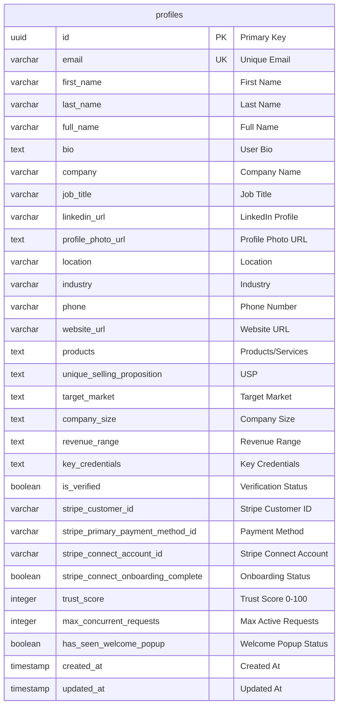
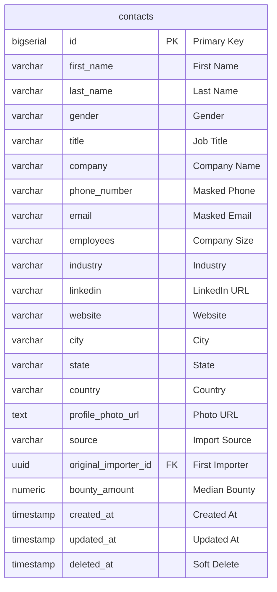
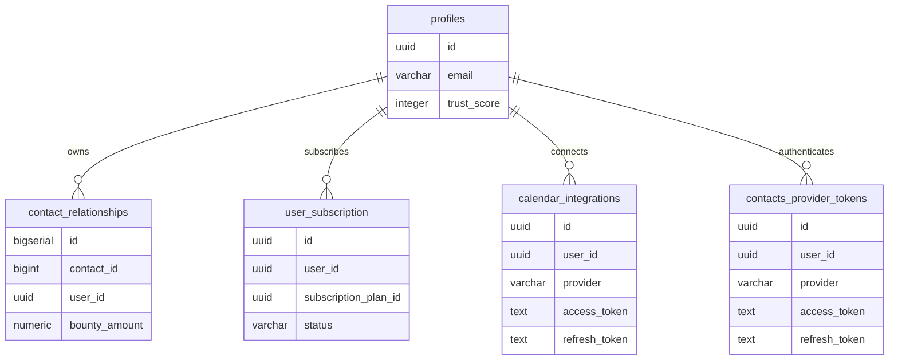
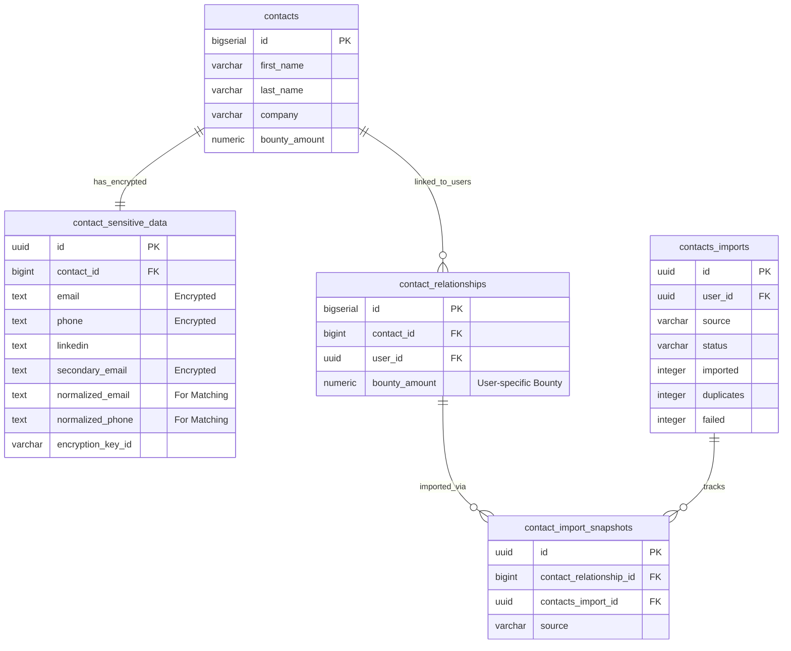
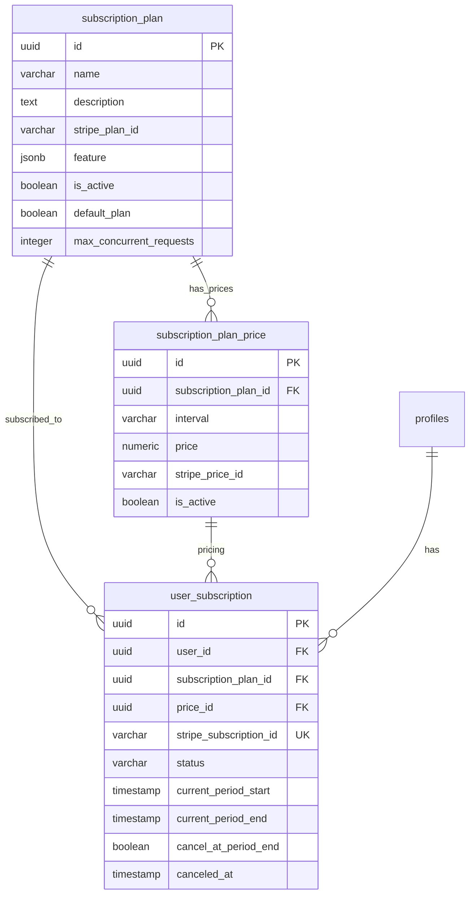
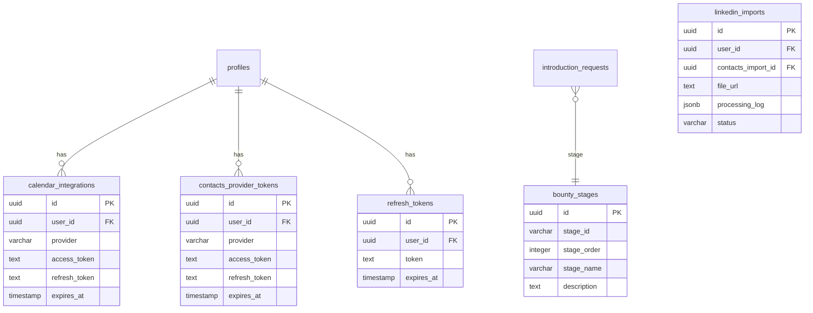
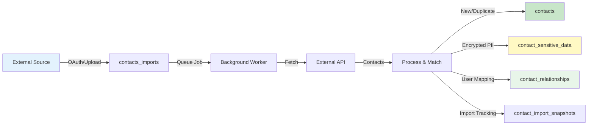
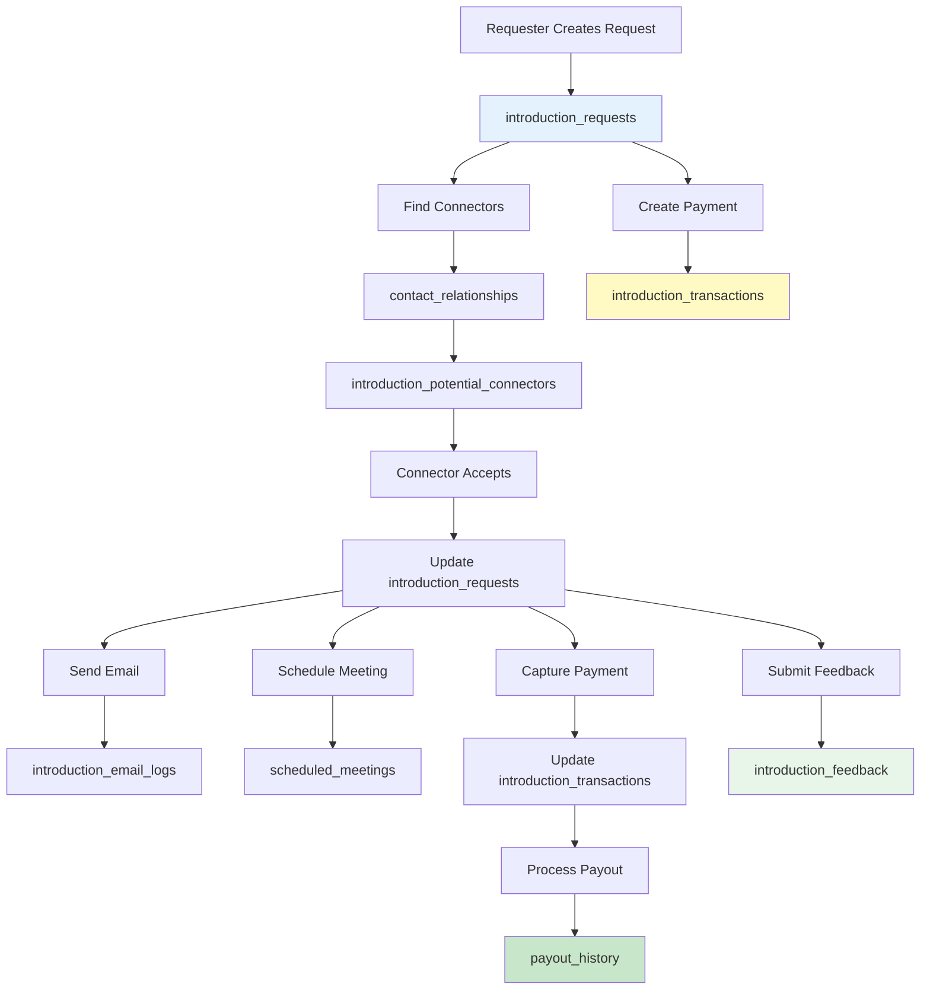
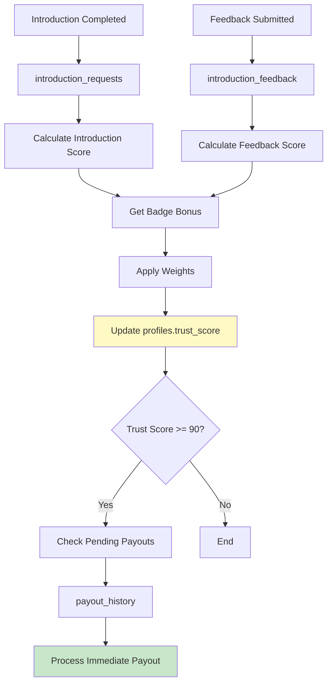

# Prospectly Database Schema

This document provides a comprehensive overview of the Prospectly database schema, including entity relationships, table structures, and data flow.

## Table of Contents

1. [High-Level Entity Relationship Diagram](#1-high-level-entity-relationship-diagram)
2. [Core Tables](#2-core-tables)
3. [User and Profile Tables](#3-user-and-profile-tables)
4. [Contact Management Tables](#4-contact-management-tables)
5. [Introduction Request Tables](#5-introduction-request-tables)
6. [Payment and Financial Tables](#6-payment-and-financial-tables)
7. [Subscription Tables](#7-subscription-tables)
8. [Supporting Tables](#8-supporting-tables)

---

## 1. High-Level Entity Relationship Diagram

Overall database schema showing all major entities and their relationships.

```mermaid
erDiagram
    profiles ||--o{ contact_relationships : "has"
    profiles ||--o{ introduction_requests : "creates"
    profiles ||--o{ introduction_requests : "accepts"
    profiles ||--o{ user_subscription : "has"
    profiles ||--o{ introduction_feedback : "gives"
    profiles ||--o{ introduction_feedback : "receives"
    profiles ||--o{ payout_history : "receives"
    profiles ||--o{ calendar_integrations : "has"
    
    contacts ||--o{ contact_relationships : "linked_to"
    contacts ||--o{ contact_sensitive_data : "has"
    contacts ||--o{ introduction_requests : "targets"
    contacts ||--o{ contact_import_snapshots : "imported_via"
    
    contact_relationships ||--o{ contact_import_snapshots : "has"
    
    introduction_requests ||--|| introduction_transactions : "has"
    introduction_requests ||--o{ introduction_potential_connectors : "has"
    introduction_requests ||--o{ scheduled_meetings : "has"
    introduction_requests ||--o{ introduction_feedback : "has"
    introduction_requests ||--o{ introduction_email_logs : "has"
    introduction_requests ||--|| payout_history : "generates"
    
    introduction_transactions ||--|| payout_history : "funds"
    
    subscription_plan ||--o{ subscription_plan_price : "has"
    subscription_plan ||--o{ user_subscription : "used_by"
    
    contacts_imports ||--o{ contact_import_snapshots : "tracks"
    
    profiles {
        uuid id PK
        varchar email UK
        varchar first_name
        varchar last_name
        varchar full_name
        text bio
        varchar company
        varchar job_title
        integer trust_score
        varchar stripe_customer_id
        varchar stripe_connect_account_id
        integer max_concurrent_requests
    }
    
    contacts {
        bigserial id PK
        varchar first_name
        varchar last_name
        varchar email
        varchar phone_number
        varchar company
        varchar title
        varchar linkedin
        uuid original_importer_id FK
        numeric bounty_amount
    }
    
    contact_sensitive_data {
        uuid id PK
        bigint contact_id FK
        text email
        text phone
        text linkedin
        text secondary_email
        text normalized_email
        text normalized_phone
        varchar encryption_key_id
    }
    
    contact_relationships {
        bigserial id PK
        bigint contact_id FK
        uuid user_id FK
        numeric bounty_amount
    }
    
    introduction_requests {
        uuid id PK
        uuid requester_id FK
        uuid accepted_by FK
        bigint contact_id FK
        varchar contact_name
        numeric bounty_amount
        numeric adjusted_bounty_amount
        varchar status
        text meeting_description
        uuid bounty_stages_id FK
        boolean requester_archived
        boolean connector_archived
    }
    
    introduction_transactions {
        uuid id PK
        uuid introduction_request_id FK UK
        numeric total_authorized_amount
        numeric total_captured_amount
        varchar overall_status
    }
    
    payout_history {
        uuid id PK
        uuid connector_id FK
        uuid introduction_request_id FK UK
        uuid introduction_transaction_id FK
        numeric gross_amount
        numeric platform_commission_amount
        numeric net_amount
        varchar status
        varchar payout_triggered_by
        integer trust_score_at_payout
        varchar stripe_transfer_id
        varchar stripe_payout_id
    }
    
    introduction_potential_connectors {
        uuid id PK
        uuid request_id FK
        uuid potential_connector_id FK
        varchar status
    }
    
    scheduled_meetings {
        uuid id PK
        uuid introduction_request_id FK
        uuid requester_id FK
        timestamp meeting_date
        varchar meeting_platform
        text meeting_link
    }
    
    introduction_feedback {
        uuid id PK
        uuid introduction_id FK
        uuid feedback_from_user_id FK
        uuid feedback_to_user_id FK
        numeric rating
        text feedback_text
        varchar feedback_type
    }
    
    user_subscription {
        uuid id PK
        uuid user_id FK
        uuid subscription_plan_id FK
        uuid price_id FK
        varchar stripe_subscription_id UK
        varchar status
    }
    
    subscription_plan {
        uuid id PK
        varchar name
        text description
        varchar stripe_plan_id
        jsonb feature
        integer max_concurrent_requests
    }
```

---

## 2. Core Tables

### 2.1 Profiles Table

User profiles with authentication, trust scores, and Stripe integration.



### 2.2 Contacts Table

Global contact registry with masked PII.



---

## 3. User and Profile Tables

Relationship between users and their data.



---

## 4. Contact Management Tables

Contact storage, relationships, and sensitive data handling.



---

## 5. Introduction Request Tables

Introduction request lifecycle and related data.

```mermaid
erDiagram
    introduction_requests ||--|| introduction_transactions : "payment"
    introduction_requests ||--o{ introduction_potential_connectors : "potential"
    introduction_requests ||--o{ scheduled_meetings : "schedules"
    introduction_requests ||--o{ introduction_feedback : "feedback"
    introduction_requests ||--o{ introduction_email_logs : "emails"
    introduction_requests ||--|| payout_history : "payout"
    introduction_requests }o--|| contacts : "targets"
    introduction_requests }o--|| profiles : "requester"
    introduction_requests }o--|| profiles : "accepted_by"
    
    introduction_requests {
        uuid id PK
        uuid requester_id FK
        uuid accepted_by FK
        bigint contact_id FK
        varchar contact_name
        numeric bounty_amount
        numeric adjusted_bounty_amount
        varchar status
        text meeting_description
        boolean requester_archived
        boolean connector_archived
    }
    
    introduction_transactions {
        uuid id PK
        uuid introduction_request_id FK UK
        numeric total_authorized_amount
        numeric total_captured_amount
        varchar overall_status
    }
    
    introduction_potential_connectors {
        uuid id PK
        uuid request_id FK
        uuid potential_connector_id FK
        varchar status
    }
    
    scheduled_meetings {
        uuid id PK
        uuid introduction_request_id FK
        uuid requester_id FK
        timestamp meeting_date
        text meeting_link
    }
    
    introduction_feedback {
        uuid id PK
        uuid introduction_id FK
        uuid feedback_from_user_id FK
        uuid feedback_to_user_id FK
        numeric rating
        text feedback_text
        varchar feedback_type
    }
    
    introduction_email_logs {
        uuid id PK
        uuid introduction_request_id FK
        varchar subject
        text body
        timestamp sent_at
    }
```

---

## 6. Payment and Financial Tables

Payment processing and payout tracking.

```mermaid
erDiagram
    introduction_requests ||--|| introduction_transactions : "has"
    introduction_transactions ||--|| payout_history : "funds"
    introduction_requests ||--|| payout_history : "generates"
    profiles ||--o{ payout_history : "receives"
    
    introduction_transactions {
        uuid id PK
        uuid introduction_request_id FK UK
        varchar payment_method_id
        numeric total_authorized_amount
        numeric total_captured_amount
        varchar overall_status
        timestamp payment_authorized_at
        timestamp fully_paid_at
        text payment_error
    }
    
    payout_history {
        uuid id PK
        uuid connector_id FK
        uuid introduction_request_id FK UK
        uuid introduction_transaction_id FK
        numeric gross_amount
        numeric platform_commission_amount
        numeric net_amount
        varchar connector_stripe_account_id
        varchar stripe_transfer_id
        varchar stripe_payout_id
        varchar status
        varchar payout_mode
        boolean payout_eligible
        boolean payout_released
        timestamp payout_released_at
        varchar payout_triggered_by
        integer trust_score_at_payout
        varchar processing_status
        timestamp processing_started_at
        timestamp processing_completed_at
        integer retry_count
        varchar job_id
        text error_message
    }
```

---

## 7. Subscription Tables

Subscription plan and user subscription management.



---

## 8. Supporting Tables

Additional tables for system functionality.



---

## Data Flow Diagrams

### Contact Import Data Flow



### Introduction Request Data Flow



### Trust Score Calculation Data Flow



---

## Index Strategy

### Primary Indexes

- All tables have primary key indexes
- Foreign key columns are indexed for join performance
- Unique constraints create unique indexes

### Performance Indexes

```sql
-- Contact matching performance
idx_contacts_email ON contacts(email)
idx_contacts_phone_number ON contacts(phone_number)
idx_contact_sensitive_data_normalized_email ON contact_sensitive_data(normalized_email)
idx_contact_sensitive_data_normalized_phone ON contact_sensitive_data(normalized_phone)

-- Introduction request queries
idx_introduction_requests_requester_id ON introduction_requests(requester_id)
idx_introduction_requests_accepted_by ON introduction_requests(accepted_by)
idx_introduction_requests_status ON introduction_requests(status)
idx_introduction_requests_contact_id ON introduction_requests(contact_id)

-- Connector finding
idx_contact_relationships_contact_user ON contact_relationships(contact_id, user_id)
idx_introduction_potential_connectors_request_id ON introduction_potential_connectors(request_id)
idx_introduction_potential_connectors_potential_connector_id ON introduction_potential_connectors(potential_connector_id)

-- Payment and payout tracking
idx_introduction_transactions_request ON introduction_transactions(introduction_request_id)
idx_payout_history_connector ON payout_history(connector_id)
idx_payout_history_status ON payout_history(status)
idx_payout_history_intro_request ON payout_history(introduction_request_id)

-- Subscription queries
idx_user_subscription_user_id ON user_subscription(user_id)
idx_user_subscription_status ON user_subscription(status)
```

---

## Data Encryption

### Encrypted Fields

The following fields are encrypted at rest in `contact_sensitive_data`:

- `email` - Primary email address
- `phone` - Phone number
- `secondary_email` - Secondary email address

### Normalized Fields

For efficient matching without decryption:

- `normalized_email` - Lowercase, trimmed email
- `normalized_phone` - Core digits only
- `normalized_secondary_email` - Normalized secondary email

These normalized fields enable fast duplicate detection during import without decrypting sensitive data.

---

## Soft Deletes

The following tables use soft deletes (deleted_at timestamp):

- `contacts` - Contacts can be soft deleted
- `introduction_requests` - Requests archived via boolean flags (requester_archived, connector_archived)

---

*Last Updated: January 2025*
