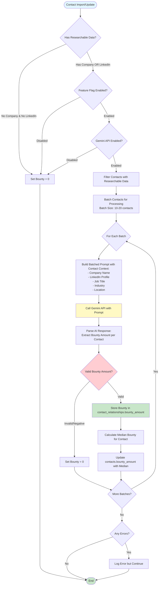
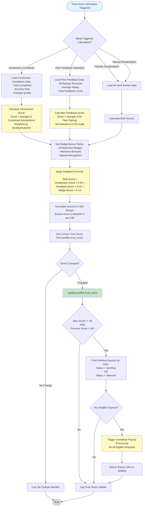

# Prospectly Engine Diagrams

This document provides detailed flowcharts for all critical engines and systems in the Prospectly platform.

## Table of Contents

1. [Bounty Engine](#1-bounty-engine)
2. [Trust Score Engine](#2-trust-score-engine)
3. [Connector Finding Engine](#3-connector-finding-engine)
4. [Contact Matching/Merging Engine](#4-contact-matchingmerging-engine)
5. [Payment Processing Engine](#5-payment-processing-engine)
6. [Payout Processing Engine](#6-payout-processing-engine)

---

## 1. Bounty Engine

AI-powered bounty calculation engine using Google Gemini API.



### Bounty Calculation Details

**Input Requirements:**
- Company name OR LinkedIn URL (at least one required)
- Optional: Job title, industry, location for better accuracy

**AI Prompt Structure:**
```
Analyze the following contacts and suggest appropriate bounty amounts 
(based on their professional value, role, company, and LinkedIn presence):
[Contact 1: Company, Title, LinkedIn...]
[Contact 2: Company, Title, LinkedIn...]
...
Return JSON: [{"index": 0, "bounty": 150}, ...]
```

**Output:**
- Bounty amount (0-999,999) stored per user-contact relationship
- Median bounty calculated across all users for the contact

---

## 2. Trust Score Engine

Trust score calculation and update system.



### Trust Score Components

**Introduction Score (50% weight):**
- Based on completed introductions
- Factors: completion rate, success rate, quality metrics
- Range: 0-100

**Feedback Score (40% weight):**
- Average of all peer ratings received
- Minimum ratings required for valid score
- Range: 0-100

**Badge Bonus (10% weight):**
- Achievement-based points
- Milestone bonuses
- Special recognition awards
- Range: 0-20 points

**Final Score:**
- Weighted sum normalized to 0-100
- Stored in `profiles.trust_score`
- Updated after each introduction completion or feedback submission

---

## 3. Connector Finding Engine

Engine for finding potential connectors for introduction requests.

```mermaid
flowchart TD
    Start([Find Connectors for Request]) --> GetContactId[Get Contact ID from Request]
    GetContactId --> QueryRelationships[Query contact_relationships:<br/>WHERE contact_id = request.contact_id]
    
    QueryRelationships --> GetConnectorIds[Get All User IDs with This Contact]
    GetConnectorIds --> FilterConnectors{For Each Potential Connector}
    
    FilterConnectors --> CheckNotRequester{Is User the Requester?}
    CheckNotRequester -->|Yes| SkipConnector[Skip This Connector]
    CheckNotRequester -->|No| CheckStripeConnect{Has Stripe Connect Account?}
    
    SkipConnector --> NextConnector
    
    CheckStripeConnect -->|No| SkipConnector
    CheckStripeConnect -->|Yes| CheckConcurrentLimit{Check max_concurrent_requests}
    
    CheckConcurrentLimit --> CountActiveRequests[Count Active Requests for User:<br/>Status IN ('accepted', 'intro_sent',<br/>'meeting_scheduled', 'meeting_booked')]
    CountActiveRequests --> CompareLimit{Active Requests < max_concurrent_requests?}
    
    CompareLimit -->|No| SkipConnector
    CompareLimit -->|Yes| CheckActiveStatus{User Account Active?}
    
    CheckActiveStatus -->|No| SkipConnector
    CheckActiveStatus -->|Yes| AddToPotentialList[Add to Potential Connectors List]
    
    AddToPotentialList --> GetConnectorBounty[Get Connector's Bounty Amount<br/>from contact_relationships]
    GetConnectorBounty --> GetRequesterBounty[Get Requester's Bounty Amount<br/>from introduction_requests]
    GetRequesterBounty --> CompareBounties{Requester Bounty >= Connector Bounty?}
    
    CompareBounties -->|Yes| CanAccept[Mark as Can Accept]
    CompareBounties -->|No| CanRevise[Mark as Can Revise Bounty]
    
    CanAccept --> NextConnector
    CanRevise --> NextConnector
    
    NextConnector{More Connectors?} -->|Yes| FilterConnectors
    NextConnector -->|No| RankConnectors[Rank Connectors by:<br/>1. Trust Score (descending)<br/>2. Bounty Match (exact match preferred)]
    
    RankConnectors --> CreatePotentialConnectorEntries[Create introduction_potential_connectors Entries:<br/>- request_id<br/>- potential_connector_id<br/>- status = 'pending']
    
    CreatePotentialConnectorEntries --> NotifyConnectors[Notify Potential Connectors:<br/>- Inbox Notification<br/>- Email Notification (optional)]
    
    NotifyConnectors --> End([Connectors Found and Notified])
    
    style Start fill:#e1f5ff
    style End fill:#c8e6c9
    style CheckStripeConnect fill:#fff9c4
    style CompareLimit fill:#ffcdd2
    style RankConnectors fill:#fff9c4
    style CreatePotentialConnectorEntries fill:#c8e6c9
```

### Connector Eligibility Criteria

1. **Must have contact_relationship** for the target contact
2. **Must have Stripe Connect account** (for payouts)
3. **Must be within concurrent request limit** (max_concurrent_requests)
4. **Must not be the requester** (self-introductions not allowed)
5. **Account must be active** (not suspended/banned)

### Ranking Algorithm

Connectors are ranked by:
1. **Trust Score** (descending) - Higher trust score first
2. **Bounty Match** - Exact match preferred over revision needed
3. **Response Rate** (future) - Historical acceptance rate

---

## 4. Contact Matching/Merging Engine

Smart contact matching engine for duplicate detection during import.

```mermaid
flowchart TD
    Start([Incoming Contact Data]) --> LoadExistingContacts[Load All Existing Contacts<br/>with Decrypted Sensitive Data<br/>for Global Matching]
    
    LoadExistingContacts --> Phase1PrimaryMatching[Phase 1: Primary Matching]
    
    Phase1PrimaryMatching --> CheckEmailMatch{Check Email Match}
    CheckEmailMatch --> NormalizeEmail[Normalize Email:<br/>- Lowercase<br/>- Trim whitespace]
    NormalizeEmail --> CheckPrimaryEmail{Primary Email Match?}
    CheckPrimaryEmail -->|Yes| PrimaryMatchFound[PRIMARY MATCH FOUND<br/>Confidence: 100%]
    CheckPrimaryEmail -->|No| CheckSecondaryEmail{Secondary Email Match?}
    
    CheckSecondaryEmail -->|Yes| PrimaryMatchFound
    CheckSecondaryEmail -->|No| CheckPhoneMatch{Check Phone Match}
    
    CheckPhoneMatch --> NormalizePhone[Normalize Phone:<br/>- Extract core digits<br/>- Remove formatting]
    NormalizePhone --> CompareCoreDigits{Core Digits Match?}
    CompareCoreDigits -->|Yes| PrimaryMatchFound
    CompareCoreDigits -->|No| CheckLinkedInMatch{Check LinkedIn Match}
    
    CheckLinkedInMatch --> NormalizeLinkedIn[Normalize LinkedIn URL:<br/>- Extract username<br/>- Remove protocol/domain]
    NormalizeLinkedIn --> CompareLinkedIn{LinkedIn Username Match?}
    CompareLinkedIn -->|Yes| PrimaryMatchFound
    CompareLinkedIn -->|No| Phase2WeightedScoring[Phase 2: Weighted Scoring]
    
    PrimaryMatchFound --> DuplicateDetected([DUPLICATE DETECTED<br/>100% Confidence])
    
    Phase2WeightedScoring --> CalculateEmailScore[Calculate Email Similarity Score<br/>Weight: 30%]
    CalculateEmailScore --> CalculateNameScore[Calculate Name Similarity Score<br/>with Nickname Detection<br/>Weight: 25%]
    CalculateNameScore --> CalculateCompanyScore[Calculate Company Similarity Score<br/>with Normalization<br/>Weight: 18%]
    CalculateCompanyScore --> CalculatePhoneScore[Calculate Phone Similarity Score<br/>Weight: 15%]
    CalculatePhoneScore --> CalculateTitleScore[Calculate Title Similarity Score<br/>Weight: 7%]
    CalculateTitleScore --> CalculateLocationBonus[Calculate Location Bonus<br/>Weight: 5%]
    
    CalculateLocationBonus --> CalculateSecondaryEmailBonus[Check Secondary Email Match<br/>Bonus Weight: Variable]
    CalculateSecondaryEmailBonus --> SumWeightedScore[Sum Weighted Scores:<br/>Total = Email×0.30 + Name×0.25 +<br/>Company×0.18 + Phone×0.15 +<br/>Title×0.07 + Location×0.05 +<br/>Secondary Email Bonus]
    
    SumWeightedScore --> CapScore[Cap Score at 1.0<br/>if exceeds 100%]
    CapScore --> CheckThreshold{Score >= 75%?}
    
    CheckThreshold -->|Yes >= 75%| DuplicateDetected
    CheckThreshold -->|No < 75%| NewContact([NEW CONTACT<br/>No Match Found])
    
    DuplicateDetected --> UpdateExistingContact{Update Missing Fields?}
    UpdateExistingContact -->|Yes| EnrichContact[Enrich Existing Contact:<br/>- Update empty fields only<br/>- Preserve existing data]
    UpdateExistingContact -->|No| CreateRelationship[Create contact_relationship<br/>for importing user]
    
    EnrichContact --> CreateRelationship
    NewContact --> CreateNewContact[Create New Contact Record]
    CreateNewContact --> CreateSensitiveData[Create Encrypted Sensitive Data]
    CreateSensitiveData --> CreateRelationship
    
    CreateRelationship --> End([Contact Processed])
    
    style Start fill:#e1f5ff
    style End fill:#c8e6c9
    style PrimaryMatchFound fill:#ffcdd2
    style DuplicateDetected fill:#ffcdd2
    style NewContact fill:#c8e6c9
    style Phase2WeightedScoring fill:#fff9c4
    style SumWeightedScore fill:#fff9c4
```



### Matching Algorithm Details

**Phase 1: Primary Matching (Exact Matches)**
- **Email Match**: Normalized primary or secondary email
- **Phone Match**: Core digits (last 10 digits) match
- **LinkedIn Match**: Normalized profile username match
- **Result**: If any match → 100% confidence duplicate

**Phase 2: Weighted Scoring (Fuzzy Matching)**
- **Email Similarity (30%)**: Domain match, typo detection
- **Name Similarity (25%)**: Levenshtein distance, nickname detection
- **Company Similarity (18%)**: Normalized company name (remove Inc, LLC, etc.)
- **Phone Similarity (15%)**: Partial digit matches
- **Title Similarity (7%)**: Job title similarity
- **Location Bonus (5%)**: City/state match bonus
- **Secondary Email Bonus**: Additional weight if secondary emails match

**Thresholds:**
- **≥ 90%**: High confidence duplicate
- **≥ 75%**: Medium confidence duplicate
- **< 75%**: New contact

**Nickname Detection:**
- William ↔ Bill, Will, Billy, Liam
- Robert ↔ Rob, Bob, Bobby
- Michael ↔ Mike, Mikey
- 40+ common name variations supported

---

## 5. Payment Processing Engine

Payment processing with dual PaymentIntent system and milestone-based captures.

```mermaid
flowchart TD
    Start([Introduction Request Created]) --> GetBountyAmount[Get Bounty Amount from Request]
    GetBountyAmount --> CalculateSplit[Calculate Payment Split:<br/>Initial: 5% of total<br/>Remaining: 95% of total]
    
    CalculateSplit --> CreateInitialIntent[Create PaymentIntent 1:<br/>Amount = 5% Initial<br/>Capture Method = Manual]
    CreateInitialIntent --> CreateRemainingIntent[Create PaymentIntent 2:<br/>Amount = 95% Remaining<br/>Capture Method = Manual]
    
    CreateRemainingIntent --> AuthorizeInitial[Authorize Initial PaymentIntent<br/>with Payment Method]
    AuthorizeInitial --> AuthorizeRemaining[Authorize Remaining PaymentIntent<br/>with Payment Method]
    
    AuthorizeInitial --> CheckAuthorization{Both Authorized?}
    AuthorizeRemaining --> CheckAuthorization
    
    CheckAuthorization -->|Failed| PaymentError[Payment Authorization Failed]
    CheckAuthorization -->|Success| CreateTransaction[Create introduction_transactions Record:<br/>- total_authorized_amount<br/>- overall_status = 'authorized']
    
    PaymentError --> EndError([Request Creation Failed])
    
    CreateTransaction --> StorePaymentMethod[Store Payment Method ID<br/>in transaction]
    StorePaymentMethod --> RequestCreated([Request Created<br/>Payment Authorized])
    
    RequestCreated --> WaitForIntroEmail{Intro Email Sent?}
    WaitForIntroEmail -->|Yes| CaptureInitialPayment[Capture 5% Initial Payment]
    WaitForIntroEmail -->|No| ContinueWaiting1[Continue Waiting]
    ContinueWaiting1 --> WaitForIntroEmail
    
    CaptureInitialPayment --> UpdateTransaction1[Update Transaction:<br/>- total_captured_amount += 5%<br/>- payment_authorized_at = now]
    UpdateTransaction1 --> InitialCaptured([Initial Payment Captured])
    
    InitialCaptured --> WaitForMeetingBooked{Meeting Booked?}
    WaitForMeetingBooked -->|Yes| CaptureRemainingPayment[Capture 95% Remaining Payment]
    WaitForMeetingBooked -->|No| ContinueWaiting2[Continue Waiting]
    ContinueWaiting2 --> WaitForMeetingBooked
    
    CaptureRemainingPayment --> UpdateTransaction2[Update Transaction:<br/>- total_captured_amount += 95%<br/>- overall_status = 'fully_paid'<br/>- fully_paid_at = now]
    UpdateTransaction2 --> FullPaymentCaptured([Full Payment Captured])
    
    FullPaymentCaptured --> CalculatePayoutSplit[Calculate Payout Split:<br/>Connector: 80% of captured<br/>Platform: 20% of captured]
    
    CalculatePayoutSplit --> GetConnectorTrustScore[Get Connector Trust Score<br/>from profiles.trust_score]
    GetConnectorTrustScore --> CheckTrustScore{Trust Score >= 90?}
    
    CheckTrustScore -->|Yes| ImmediatePayoutEligible[Immediate Payout Eligible]
    CheckTrustScore -->|No| DeferredPayoutEligible[Deferred Payout Eligible<br/>Wait for Peer Feedback]
    
    ImmediatePayoutEligible --> CreatePayoutHistory[Create payout_history Record:<br/>- status = 'pending'<br/>- payout_eligible = true<br/>- payout_triggered_by = 'trust_score'<br/>- trust_score_at_payout = score]
    
    DeferredPayoutEligible --> CreatePayoutHistoryDeferred[Create payout_history Record:<br/>- status = 'pending'<br/>- payout_eligible = false<br/>- payout_triggered_by = null]
    
    CreatePayoutHistory --> QueueImmediatePayout[Queue Immediate Payout Job]
    CreatePayoutHistoryDeferred --> WaitForFeedback[Wait for Peer Feedback Submission]
    
    WaitForFeedback --> FeedbackSubmitted{Peer Feedback Submitted?}
    FeedbackSubmitted -->|Yes| UpdatePayoutEligible[Update payout_history:<br/>- payout_eligible = true<br/>- payout_triggered_by = 'peer_feedback']
    FeedbackSubmitted -->|No| ContinueWaiting3[Continue Waiting]
    ContinueWaiting3 --> FeedbackSubmitted
    
    UpdatePayoutEligible --> QueueDeferredPayout[Queue Deferred Payout Job]
    QueueImmediatePayout --> End([Payment Processing Complete])
    QueueDeferredPayout --> End
    
    style Start fill:#e1f5ff
    style End fill:#c8e6c9
    style EndError fill:#ffcdd2
    style CreateInitialIntent fill:#fff9c4
    style CreateRemainingIntent fill:#fff9c4
    style CaptureInitialPayment fill:#fff9c4
    style CaptureRemainingPayment fill:#fff9c4
    style CalculatePayoutSplit fill:#fff9c4
    style CheckTrustScore fill:#fff9c4
```



### Payment Split Calculation

**Initial Payment (5%):**
- Captured when intro email is sent
- Floor calculation to avoid overcharging
- Example: $100 → $5 initial

**Remaining Payment (95%):**
- Captured when meeting is booked
- Calculated as: Total - Initial
- Ensures exact total amount
- Example: $100 → $95 remaining

**Payout Split:**
- Connector: 80% of captured amount
- Platform: 20% of captured amount
- Example: $100 captured → $80 connector, $20 platform

---

## 6. Payout Processing Engine

Payout processing with trust score-based timing and retry logic.

```mermaid
flowchart TD
    Start([Payout Job Triggered]) --> GetJobData[Get Payout Job Data:<br/>- request_id<br/>- connector_id<br/>- trigger_type]
    
    GetJobData --> LoadRequestData[Load Introduction Request Data]
    LoadRequestData --> LoadTransactionData[Load Transaction Data]
    LoadTransactionData --> ValidateEligibility{Validate Payout Eligibility}
    
    ValidateEligibility --> CheckCaptured{Payment Fully Captured?}
    CheckCaptured -->|No| PayoutNotEligible[Payout Not Eligible<br/>Payment Not Complete]
    CheckCaptured -->|Yes| CheckConnectorAccount{Connector Has Stripe Connect?}
    
    PayoutNotEligible --> EndError([Payout Failed])
    
    CheckConnectorAccount -->|No| RequestStripeConnect[Request Stripe Connect Setup]
    RequestStripeConnect --> EndError
    
    CheckConnectorAccount -->|Yes| CheckPayoutHistory{Payout History Exists?}
    
    CheckPayoutHistory -->|No| CreatePayoutHistory[Create payout_history Record:<br/>- status = 'processing'<br/>- processing_status = 'processing'<br/>- processing_started_at = now]
    CheckPayoutHistory -->|Yes| UpdatePayoutHistory[Update payout_history:<br/>- processing_status = 'processing'<br/>- processing_started_at = now<br/>- retry_count += 1]
    
    CreatePayoutHistory --> GetCapturedAmount[Get Total Captured Amount<br/>from transaction]
    UpdatePayoutHistory --> GetCapturedAmount
    
    GetCapturedAmount --> CalculatePayoutSplit[Calculate Payout Split:<br/>Connector: 80%<br/>Platform: 20%]
    
    CalculatePayoutSplit --> GetConnectorAccount[Get Connector Stripe Connect Account ID]
    GetConnectorAccount --> CreateStripeTransfer[Create Stripe Transfer:<br/>Amount = Connector Amount<br/>Destination = Connector Account<br/>Metadata = request_id, connector_id]
    
    CreateStripeTransfer --> TransferSuccess{Transfer Successful?}
    TransferSuccess -->|Failed| HandleTransferError[Log Transfer Error]
    HandleTransferError --> CheckRetryCount{Retry Count < 3?}
    
    CheckRetryCount -->|Yes| ScheduleRetry[Schedule Retry with Exponential Backoff:<br/>1st retry: 1 minute<br/>2nd retry: 5 minutes<br/>3rd retry: 15 minutes]
    CheckRetryCount -->|No| UpdateFailedStatus[Update payout_history:<br/>- status = 'failed'<br/>- processing_status = 'failed'<br/>- error_message = error]
    
    ScheduleRetry --> EndRetry([Payout Queued for Retry])
    UpdateFailedStatus --> EndError
    
    TransferSuccess -->|Success| CreateStripePayout[Create Immediate Payout to Bank:<br/>Amount = Connector Amount<br/>From Connector's Stripe Balance<br/>To Bank Account]
    
    CreateStripePayout --> PayoutSuccess{Payout Created?}
    PayoutSuccess -->|Failed| LogPayoutWarning[Log Warning:<br/>Funds transferred but payout pending]
    PayoutSuccess -->|Success| UpdatePayoutSuccess[Update payout_history:<br/>- status = 'completed'<br/>- processing_status = 'completed'<br/>- payout_released = true<br/>- payout_released_at = now<br/>- stripe_transfer_id = transfer.id<br/>- stripe_payout_id = payout.id<br/>- processing_completed_at = now]
    
    LogPayoutWarning --> UpdatePayoutSuccess
    
    UpdatePayoutSuccess --> UpdateRequestStatus[Update introduction_requests:<br/>- payout_released = true<br/>- payout_triggered_by = trigger_type]
    
    UpdateRequestStatus --> NotifyConnector[Notify Connector:<br/>Payout Completed]
    
    NotifyConnector --> EndSuccess([Payout Completed Successfully])
    
    style Start fill:#e1f5ff
    style EndSuccess fill:#c8e6c9
    style EndError fill:#ffcdd2
    style EndRetry fill:#fff9c4
    style CreateStripeTransfer fill:#fff9c4
    style CreateStripePayout fill:#fff9c4
    style CheckRetryCount fill:#ffcdd2
```



### Payout Processing Details

**Payout Triggers:**
1. **Trust Score Trigger**: Connector trust score ≥ 90 (immediate)
2. **Peer Feedback Trigger**: After peer feedback submission (deferred)

**Processing Steps:**
1. Validate eligibility (payment captured, connector account exists)
2. Calculate payout split (80% connector, 20% platform)
3. Create Stripe Transfer to connector's Stripe balance
4. Create immediate Payout from connector balance to bank
5. Update payout_history with all details

**Retry Logic:**
- Maximum 3 retry attempts
- Exponential backoff: 1min, 5min, 15min
- Tracks retry_count and last_retry_at
- Updates processing_status throughout

**Error Handling:**
- Transfer failures: Retry with backoff
- Payout failures: Log warning (funds already transferred)
- Final failure: Mark as failed, require manual review

**Status Tracking:**
- `processing_status`: pending → queued → processing → completed/failed
- `status`: pending → processing → completed/failed
- `payout_released`: boolean flag when payout is complete

---

*Last Updated: January 2025*
