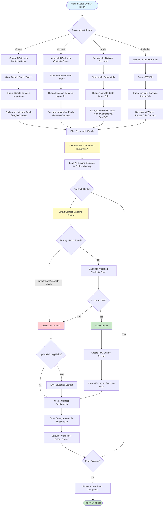
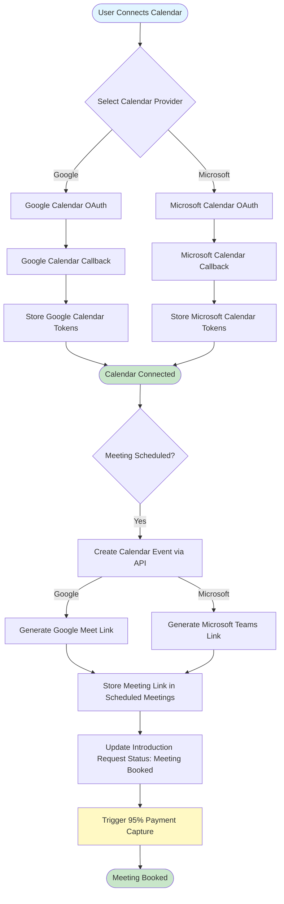
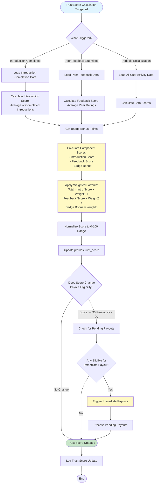

# Prospectly Flow Diagrams

This document contains comprehensive flow diagrams for all major user journeys in the Prospectly platform.

## Table of Contents

1. [Onboarding Flow](#1-onboarding-flow)
2. [Contact Import Flow](#2-contact-import-flow)
3. [Calendar Integration Flow](#3-calendar-integration-flow)
4. [Introduction Request Flow - Requester Side](#4-introduction-request-flow---requester-side)
5. [Introduction Request Flow - Connector Side](#5-introduction-request-flow---connector-side)
6. [Payment and Payout Flow](#6-payment-and-payout-flow)
7. [Trust Score System Flow](#7-trust-score-system-flow)
8. [Financial Hub Flow](#8-financial-hub-flow)
9. [Global Marketplace Flow](#9-global-marketplace-flow)

---

## 1. Onboarding Flow

Complete user onboarding from sign-in through profile setup and plan selection.

```mermaid
flowchart TD
    Start([User Visits Platform]) --> ChooseAuth{Choose Auth Method}
    ChooseAuth -->|Google| GoogleOAuth[Redirect to Google OAuth]
    ChooseAuth -->|Microsoft| MicrosoftOAuth[Redirect to Microsoft OAuth]
    
    GoogleOAuth --> GoogleCallback[Google OAuth Callback]
    MicrosoftOAuth --> MicrosoftCallback[Microsoft OAuth Callback]
    
    GoogleCallback --> ExchangeToken[Exchange Code for Tokens]
    MicrosoftCallback --> ExchangeToken
    
    ExchangeToken --> VerifyToken[Verify ID Token]
    VerifyToken --> CheckUser{User Exists?}
    
    CheckUser -->|No| CreateUser[Create New User Profile]
    CheckUser -->|Yes| LoginUser[Login Existing User]
    
    CreateUser --> GenerateJWT[Generate JWT Tokens]
    LoginUser --> GenerateJWT
    
    GenerateJWT --> CheckWelcomePopup{Has Seen Welcome Popup?}
    CheckWelcomePopup -->|No| ShowWelcomePopup[Show Welcome Subscription Popup]
    CheckWelcomePopup -->|Yes| CheckPlan{Has Active Plan?}
    
    ShowWelcomePopup --> UserSelectsPlan{User Selects Plan}
    UserSelectsPlan -->|Upgrade| CreateStripeSession[Create Stripe Customer Portal Session]
    UserSelectsPlan -->|Skip| CheckPlan
    
    CreateStripeSession --> RedirectStripe[Redirect to Stripe Checkout]
    RedirectStripe --> StripeCallback[Stripe Webhook: Subscription Created]
    StripeCallback --> UpdateSubscription[Update User Subscription]
    
    UpdateSubscription --> CheckPlan
    CheckPlan -->|No Plan| ShowPlanSelection[Show Plan Selection Page]
    CheckPlan -->|Has Plan| ProfileSetup
    
    ShowPlanSelection --> UserSelectsPlan
    
    ProfileSetup[3-Step Getting Started] --> Step1[Step 1: Profile Update]
    Step1 --> Step2[Step 2: Import Contacts]
    Step2 --> Step3[Step 3: Connect Calendar]
    Step3 --> OnboardingComplete([Onboarding Complete])
    
    style Start fill:#e1f5ff
    style OnboardingComplete fill:#c8e6c9
    style CreateStripeSession fill:#fff9c4
    style StripeCallback fill:#fff9c4
```

---

## 2. Contact Import Flow

Contact import process for Google, Microsoft, Apple, and LinkedIn sources.

---

## 3. Calendar Integration Flow

Calendar connection and meeting scheduling process.

---

## 4. Introduction Request Flow - Requester Side

Complete flow for requesters creating and managing introduction requests.

```mermaid
flowchart TD
    Start([Requester Finds Prospect]) --> BrowseContacts[Browse My Contacts]
    BrowseContacts --> SelectContact[Select Contact/Prospect]
    SelectContact --> CheckBounty{Contact Has Bounty?}
    
    CheckBounty -->|Yes| ShowBounty[Display Suggested Bounty]
    CheckBounty -->|No| SetBounty[Set Custom Bounty Amount]
    ShowBounty --> SetBounty
    
    SetBounty --> FillRequestDetails[Fill Request Details:<br/>- Meeting Title<br/>- Meeting Description<br/>- Additional Context]
    FillRequestDetails --> SelectPrivacyRules[Select Privacy Rules:<br/>- Choose domains to exclude<br/>- Prevent connectors from<br/>  seeing intro requests]
    SelectPrivacyRules --> CheckPlanLimit{Check Max Concurrent Requests}
    
    CheckPlanLimit -->|Exceeded| ShowLimitError[Show Limit Error]
    CheckPlanLimit -->|Within Limit| CreatePaymentIntents[Create Dual PaymentIntents:<br/>5% Initial + 95% Remaining]
    
    ShowLimitError --> FillRequestDetails
    
    CreatePaymentIntents --> AuthorizePayments[Authorize Both PaymentIntents]
    AuthorizePayments --> PaymentAuthorized{Payment Authorized?}
    
    PaymentAuthorized -->|Failed| ShowPaymentError[Show Payment Error]
    PaymentAuthorized -->|Success| CreateRequest[Create Introduction Request]
    
    ShowPaymentError --> FillRequestDetails
    
    CreateRequest --> GetConnectorIds[Get All Connector IDs for Contact]
    GetConnectorIds --> ApplyPrivacyFilter{Privacy Rules Selected?}
    
    ApplyPrivacyFilter -->|Yes| ExtractConnectorDomains[Extract Connector Domains:<br/>- From email addresses<br/>- From website URLs]
    ApplyPrivacyFilter -->|No| CreateConnectorEntries[Create Potential Connector Entries]
    
    ExtractConnectorDomains --> MatchDomains[Match Connector Domains<br/>with Privacy Rule Domains]
    MatchDomains --> FilterConnectors[Filter Out Matched Connectors:<br/>Exclude connectors whose domains<br/>match privacy rule domains]
    FilterConnectors --> CreateConnectorEntries
    
    CreateConnectorEntries --> CreatePrivacyHistory{Privacy Rules Applied?}
    CreatePrivacyHistory -->|Yes| StorePrivacyHistory[Store Privacy History:<br/>Snapshot of privacy rules<br/>at request creation time]
    CreatePrivacyHistory -->|No| NotifyConnectors
    
    StorePrivacyHistory --> NotifyConnectors[Notify Potential Connectors<br/>Only non-filtered connectors]
    NotifyConnectors --> RequestPending([Request Status: PENDING])
    
    RequestPending --> WaitForAcceptance{Connector Accepts?}
    WaitForAcceptance -->|Declined| RequestDeclined([Request Declined])
    WaitForAcceptance -->|Accepted| RequestAccepted([Request Status: ACCEPTED])
    
    RequestAccepted --> WaitForIntroEmail{Intro Email Sent?}
    WaitForIntroEmail -->|Yes| CaptureInitialPayment[Capture 5% Initial Payment]
    CaptureInitialPayment --> IntroSent([Request Status: INTRO_SENT])
    
    IntroSent --> WaitForMeetingScheduled{Meeting Scheduled?}
    WaitForMeetingScheduled -->|Yes| MeetingScheduled([Request Status: MEETING_SCHEDULED])
    
    MeetingScheduled --> WaitForMeetingBooked{Meeting Booked?}
    WaitForMeetingBooked -->|Yes| CaptureRemainingPayment[Capture 95% Remaining Payment]
    CaptureRemainingPayment --> MeetingBooked([Request Status: MEETING_BOOKED])
    
    MeetingBooked --> AttendMeeting[Attend Meeting]
    AttendMeeting --> MeetingCompleted([Request Status: MEETING_COMPLETED])
    
    MeetingCompleted --> SubmitFeedback[Submit Peer Feedback]
    SubmitFeedback --> PeerFeedback([Request Status: PEER_FEEDBACK])
    
    PeerFeedback --> ArchiveRequest[Archive Request]
    ArchiveRequest --> RequestArchived([Request Archived])
    
    style Start fill:#e1f5ff
    style RequestPending fill:#fff9c4
    style RequestAccepted fill:#c8e6c9
    style IntroSent fill:#c8e6c9
    style MeetingBooked fill:#c8e6c9
    style RequestArchived fill:#e0e0e0
    style CaptureInitialPayment fill:#fff9c4
    style CaptureRemainingPayment fill:#fff9c4
    style SelectPrivacyRules fill:#e1bee7
    style ExtractConnectorDomains fill:#e1bee7
    style MatchDomains fill:#e1bee7
    style FilterConnectors fill:#e1bee7
    style StorePrivacyHistory fill:#e1bee7
```

---

## 5. Introduction Request Flow - Connector Side

Complete flow for connectors receiving and fulfilling introduction requests.

```mermaid
flowchart TD
    Start([Connector Receives Request]) --> ViewInbox[View Inbox Requests]
    ViewInbox --> ReviewRequest[Review Request Details:<br/>- Prospect Info<br/>- Requester Info<br/>- Bounty Amount<br/>- Meeting Details]
    
    ReviewRequest --> CheckBountyComparison{Requester Bounty >=<br/>Connector Bounty?}
    
    CheckBountyComparison -->|No| CanReviseBounty[Can Revise Bounty]
    CheckBountyComparison -->|Yes| CanAccept[Can Accept Request]
    
    CanReviseBounty --> ReviseBountyDialog[Show Revise Bounty Dialog]
    ReviseBountyDialog --> SubmitRevision[Submit Bounty Revision]
    SubmitRevision --> NotifyRequester[Notify Requester of Revision]
    NotifyRequester --> WaitRequesterResponse{Requester Accepts<br/>Revision?}
    
    WaitRequesterResponse -->|No| RequestDeclined([Request Declined])
    WaitRequesterResponse -->|Yes| UpdateBounty[Update Request Bounty]
    UpdateBounty --> CanAccept
    
    CanAccept --> Decision{Accept or Decline?}
    Decision -->|Decline| DeclineRequest[Decline Request]
    DeclineRequest --> RequestDeclined
    
    Decision -->|Accept| AcceptRequest[Accept Request]
    AcceptRequest --> RequestAccepted([Request Status: ACCEPTED])
    
    RequestAccepted --> DraftIntroEmail[Draft Introduction Email]
    DraftIntroEmail --> ReviewEmail[Review Email Draft]
    ReviewEmail --> SendIntroEmail[Send Intro Email to Prospect]
    
    SendIntroEmail --> LogEmailSent[Log Email Sent in Email Logs]
    LogEmailSent --> CaptureInitialPayment[Trigger 5% Payment Capture]
    CaptureInitialPayment --> IntroSent([Request Status: INTRO_SENT])
    
    IntroSent --> WaitProspectResponse{Prospect Responds?}
    WaitProspectResponse -->|No Response| FollowUp[Follow Up with Prospect]
    FollowUp --> WaitProspectResponse
    WaitProspectResponse -->|Yes| ProspectResponded([Prospect Responded])
    
    ProspectResponded --> ScheduleMeeting[Schedule Meeting via Calendar]
    ScheduleMeeting --> CreateMeetingInvite[Create Meeting Invite]
    CreateMeetingInvite --> SendInvite[Send Invite to Requester & Prospect]
    SendInvite --> MeetingScheduled([Request Status: MEETING_SCHEDULED])
    
    MeetingScheduled --> MeetingBooked([Request Status: MEETING_BOOKED])
    MeetingBooked --> WaitMeetingCompletion{Meeting Completed?}
    
    WaitMeetingCompletion -->|Yes| AcknowledgeCompletion[Connector Acknowledges Meeting Completion]
    AcknowledgeCompletion --> MeetingCompleted([Request Status: MEETING_COMPLETED])
    
    MeetingCompleted --> CheckTrustScore{Connector Trust Score >= 90?}
    
    CheckTrustScore -->|Yes| ImmediatePayout[Queue Immediate Payout]
    CheckTrustScore -->|No| WaitForFeedback[Wait for Peer Feedback]
    
    ImmediatePayout --> ProcessPayout[Process Payout via Stripe]
    ProcessPayout --> PayoutCompleted([Payout Completed])
    
    WaitForFeedback --> SubmitConnectorFeedback[Submit Connector Feedback]
    SubmitConnectorFeedback --> QueueDeferredPayout[Queue Deferred Payout]
    QueueDeferredPayout --> ProcessPayout
    
    PayoutCompleted --> SubmitPeerFeedback[Submit Peer Feedback]
    SubmitPeerFeedback --> PeerFeedback([Request Status: PEER_FEEDBACK])
    
    PeerFeedback --> ArchiveRequest[Archive Request]
    ArchiveRequest --> RequestArchived([Request Archived])
    
    style Start fill:#e1f5ff
    style RequestAccepted fill:#c8e6c9
    style IntroSent fill:#c8e6c9
    style MeetingBooked fill:#c8e6c9
    style PayoutCompleted fill:#c8e6c9
    style RequestArchived fill:#e0e0e0
    style ImmediatePayout fill:#fff9c4
    style QueueDeferredPayout fill:#fff9c4
```

---

## 6. Payment and Payout Flow

Complete payment processing and payout flow with trust score-based timing.

```mermaid
flowchart TD
    Start([Introduction Request Created]) --> CreatePaymentIntents[Create Dual PaymentIntents]
    
    CreatePaymentIntents --> InitialIntent[PaymentIntent 1: 5% Initial Amount]
    CreatePaymentIntents --> RemainingIntent[PaymentIntent 2: 95% Remaining Amount]
    
    InitialIntent --> AuthorizeInitial[Authorize Initial PaymentIntent]
    RemainingIntent --> AuthorizeRemaining[Authorize Remaining PaymentIntent]
    
    AuthorizeInitial --> PaymentAuthorized{Both Authorized?}
    AuthorizeRemaining --> PaymentAuthorized
    
    PaymentAuthorized -->|Failed| PaymentError[Payment Authorization Failed]
    PaymentAuthorized -->|Success| StoreTransaction[Store Transaction Record]
    
    PaymentError --> EndError([Request Creation Failed])
    
    StoreTransaction --> RequestCreated([Request Created])
    
    RequestCreated --> IntroEmailSent{Intro Email Sent?}
    IntroEmailSent -->|Yes| CaptureInitial[Capture 5% Initial Payment]
    IntroEmailSent -->|No| WaitForIntro
    
    CaptureInitial --> UpdateTransaction[Update Transaction: 5% Captured]
    UpdateTransaction --> InitialCaptured([Initial Payment Captured])
    
    InitialCaptured --> MeetingBooked{Meeting Booked?}
    MeetingBooked -->|Yes| CaptureRemaining[Capture 95% Remaining Payment]
    MeetingBooked -->|No| WaitForMeeting
    
    CaptureRemaining --> UpdateTransactionFull[Update Transaction: 100% Captured]
    UpdateTransactionFull --> FullPaymentCaptured([Full Payment Captured])
    
    FullPaymentCaptured --> CalculatePayoutSplit[Calculate Payout Split:<br/>80% Connector + 20% Platform]
    CalculatePayoutSplit --> CheckConnectorTrustScore{Connector Trust Score >= 90?}
    
    CheckConnectorTrustScore -->|Yes| ImmediatePayoutEligible[Immediate Payout Eligible]
    CheckConnectorTrustScore -->|No| DeferredPayoutEligible[Deferred Payout Eligible]
    
    ImmediatePayoutEligible --> CheckStripeConnect{Connector Has Stripe Connect?}
    DeferredPayoutEligible --> WaitForPeerFeedback[Wait for Peer Feedback]
    
    WaitForPeerFeedback --> PeerFeedbackSubmitted{Peer Feedback Submitted?}
    PeerFeedbackSubmitted -->|Yes| CheckStripeConnect
    PeerFeedbackSubmitted -->|No| ContinueWaiting[Continue Waiting]
    ContinueWaiting --> PeerFeedbackSubmitted
    
    CheckStripeConnect -->|No| RequestStripeConnect[Request Stripe Connect Setup]
    RequestStripeConnect --> StripeConnectSetup[User Completes Stripe Connect Onboarding]
    StripeConnectSetup --> CheckStripeConnect
    
    CheckStripeConnect -->|Yes| CreatePayoutHistory[Create Payout History Record]
    CreatePayoutHistory --> QueuePayoutJob[Queue Payout Job in BullMQ]
    
    QueuePayoutJob --> ProcessPayoutJob[Background Worker: Process Payout]
    ProcessPayoutJob --> CreateStripeTransfer[Create Stripe Transfer to Connector Account]
    
    CreateStripeTransfer --> TransferSuccess{Transfer Successful?}
    TransferSuccess -->|Failed| RetryPayout{Retry Count < 3?}
    RetrySuccess -->|Yes| RetryPayout[Retry with Exponential Backoff]
    RetryPayout --> ProcessPayoutJob
    RetryPayout -->|No| PayoutFailed([Payout Failed - Manual Review])
    
    TransferSuccess -->|Success| CreateStripePayout[Create Immediate Payout to Bank Account]
    CreateStripePayout --> PayoutSuccess{Payout Successful?}
    
    PayoutSuccess -->|Failed| RetryPayout
    PayoutSuccess -->|Success| UpdatePayoutHistory[Update Payout History:<br/>- Status: Completed<br/>- Transfer ID<br/>- Payout ID]
    
    UpdatePayoutHistory --> PayoutCompleted([Payout Completed])
    
    style Start fill:#e1f5ff
    style FullPaymentCaptured fill:#c8e6c9
    style PayoutCompleted fill:#c8e6c9
    style PaymentError fill:#ffcdd2
    style PayoutFailed fill:#ffcdd2
    style CaptureInitial fill:#fff9c4
    style CaptureRemaining fill:#fff9c4
    style CreateStripeTransfer fill:#fff9c4
```

---

## 7. Trust Score System Flow

Trust score calculation and update flow.

---

## 8. Financial Hub Flow

Financial hub operations including transaction viewing, payout tracking, and bank account setup.

```mermaid
flowchart TD
    Start([User Accesses Financial Hub]) --> ViewTransactions[View Transaction History]
    ViewTransactions --> FilterTransactions{Filter Transactions?}
    
    FilterTransactions -->|By Status| FilterByStatus[Filter by Payment Status]
    FilterTransactions -->|By Date| FilterByDate[Filter by Date Range]
    FilterTransactions -->|By Type| FilterByType[Filter by Transaction Type]
    FilterTransactions -->|No Filter| ShowAllTransactions[Show All Transactions]
    
    FilterByStatus --> ShowAllTransactions
    FilterByDate --> ShowAllTransactions
    FilterByType --> ShowAllTransactions
    
    ShowAllTransactions --> ViewTransactionDetails[View Transaction Details:<br/>- Payment Amounts<br/>- Capture Status<br/>- Timestamps]
    
    ViewTransactionDetails --> ViewPayoutHistory[View Payout History]
    ViewPayoutHistory --> FilterPayouts{Filter Payouts?}
    
    FilterPayouts -->|By Status| FilterPayoutStatus[Filter by Payout Status]
    FilterPayouts -->|By Date| FilterPayoutDate[Filter by Date Range]
    FilterPayouts -->|No Filter| ShowAllPayouts[Show All Payouts]
    
    FilterPayoutStatus --> ShowAllPayouts
    FilterPayoutDate --> ShowAllPayouts
    
    ShowAllPayouts --> ViewPayoutDetails[View Payout Details:<br/>- Gross Amount<br/>- Platform Commission<br/>- Net Amount<br/>- Payout Status<br/>- Transfer ID<br/>- Payout ID]
    
    ViewPayoutDetails --> CheckStripeConnect{Has Stripe Connect Account?}
    
    CheckStripeConnect -->|No| SetupStripeConnect[Setup Stripe Connect Account]
    CheckStripeConnect -->|Yes| CheckOnboardingComplete{Onboarding Complete?}
    
    SetupStripeConnect --> CreateConnectAccount[Create Stripe Connect Account]
    CreateConnectAccount --> GenerateOnboardingLink[Generate Onboarding Link]
    GenerateOnboardingLink --> RedirectToStripe[Redirect to Stripe Onboarding]
    RedirectToStripe --> CompleteOnboarding[User Completes Onboarding:<br/>- Business Info<br/>- Bank Account Details]
    CompleteOnboarding --> StripeWebhook[Stripe Webhook: Account Updated]
    StripeWebhook --> UpdateOnboardingStatus[Update Onboarding Status]
    UpdateOnboardingStatus --> CheckOnboardingComplete
    
    CheckOnboardingComplete -->|No| RedirectToStripe
    CheckOnboardingComplete -->|Yes| ViewBankAccount[View Connected Bank Account]
    
    ViewBankAccount --> MonitorPayoutStatus[Monitor Payout Status]
    MonitorPayoutStatus --> PayoutStatus{Payout Status?}
    
    PayoutStatus -->|Pending| ShowPending[Show Pending Status]
    PayoutStatus -->|Processing| ShowProcessing[Show Processing Status]
    PayoutStatus -->|Completed| ShowCompleted[Show Completed Status with Details]
    PayoutStatus -->|Failed| ShowFailed[Show Failed Status with Error]
    
    ShowPending --> RefreshStatus[Refresh Status]
    ShowProcessing --> RefreshStatus
    ShowCompleted --> ViewDetails[View Full Payout Details]
    ShowFailed --> ViewError[View Error Details]
    
    RefreshStatus --> MonitorPayoutStatus
    ViewDetails --> End([End])
    ViewError --> End
    
    style Start fill:#e1f5ff
    style ShowCompleted fill:#c8e6c9
    style ShowFailed fill:#ffcdd2
    style CreateConnectAccount fill:#fff9c4
    style CompleteOnboarding fill:#fff9c4
```

---

## 9. Global Marketplace Flow

Global marketplace for browsing and claiming introduction opportunities.

```mermaid
flowchart TD
    Start([User Accesses Global Marketplace]) --> BrowseOpportunities[Browse Available Opportunities]
    BrowseOpportunities --> ApplyFilters[Apply Filters:<br/>- Industry<br/>- Bounty Range<br/>- Match Score<br/>- Urgency]
    
    ApplyFilters --> DisplayFiltered[Display Filtered Opportunities]
    DisplayFiltered --> SelectOpportunity[Select Opportunity to View]
    
    SelectOpportunity --> ViewOpportunityDetails[View Opportunity Details:<br/>- Prospect Info<br/>- Requester Info<br/>- Bounty Amount<br/>- Match Score<br/>- Meeting Details]
    
    ViewOpportunityDetails --> CheckRequesterReviews{View Requester Reviews?}
    CheckRequesterReviews -->|Yes| ShowRequesterStats[Show Requester Stats:<br/>- Successful Intros<br/>- Completion Rate<br/>- Average Rating<br/>- Total Reviews]
    CheckRequesterReviews -->|No| MakeDecision
    
    ShowRequesterStats --> MakeDecision{Make Introduction?}
    
    MakeDecision -->|No| BrowseOpportunities
    MakeDecision -->|Yes| CheckExistingRequest{Check if Already Claimed}
    
    CheckExistingRequest --> AlreadyClaimed{Already Claimed?}
    AlreadyClaimed -->|Yes| ShowUnavailable[Show Opportunity Unavailable]
    AlreadyClaimed -->|No| ClaimOpportunity[Claim Opportunity]
    
    ShowUnavailable --> BrowseOpportunities
    
    ClaimOpportunity --> CreateRequestFromMarketplace[Create Introduction Request from Marketplace]
    CreateRequestFromMarketplace --> SetMarketplaceVisible[Set is_marketplace_visible = false]
    SetMarketplaceVisible --> ProcessPayment[Process Payment Authorization]
    
    ProcessPayment --> PaymentSuccess{Payment Successful?}
    PaymentSuccess -->|Failed| ShowPaymentError[Show Payment Error]
    PaymentSuccess -->|Success| RequestCreated([Request Created])
    
    ShowPaymentError --> ViewOpportunityDetails
    
    RequestCreated --> FindConnectors[Find Potential Connectors]
    FindConnectors --> NotifyConnector[Notify Connector]
    NotifyConnector --> RequestInPipeline([Request in Pipeline])
    
    RequestInPipeline --> ContinueNormalFlow[Continue with Normal Introduction Flow]
    
    style Start fill:#e1f5ff
    style RequestCreated fill:#c8e6c9
    style RequestInPipeline fill:#c8e6c9
    style ShowUnavailable fill:#ffcdd2
    style ClaimOpportunity fill:#fff9c4
    style ProcessPayment fill:#fff9c4
```

---

## End-to-End Complete Flow

Complete end-to-end flow from sign-in to payout completion.

```mermaid
flowchart LR
    subgraph Onboarding["1. Onboarding"]
        A1[Sign In] --> A2[Plan Upgrade] --> A3[Profile Setup] --> A4[Import Contacts]
    end
    
    subgraph ContactImport["2. Contact Import"]
        B1[OAuth/Upload] --> B2[Fetch Contacts] --> B3[Match & Dedupe] --> B4[Calculate Bounty] --> B5[Earn Credits]
    end
    
    subgraph Calendar["3. Calendar"]
        C1[Connect Calendar] --> C2[Store Tokens]
    end
    
    subgraph Request["4. Create Request"]
        D1[Select Prospect] --> D2[Set Bounty] --> D3[Authorize Payment] --> D4[Find Connectors]
    end
    
    subgraph Connector["5. Connector Flow"]
        E1[Receive Request] --> E2[Accept/Revise] --> E3[Send Intro Email] --> E4[Schedule Meeting]
    end
    
    subgraph Payment["6. Payment & Payout"]
        F1[Capture 5%] --> F2[Capture 95%] --> F3[Check Trust Score] --> F4[Process Payout]
    end
    
    subgraph Feedback["7. Feedback"]
        G1[Meeting Complete] --> G2[Submit Feedback] --> G3[Update Trust Score]
    end
    
    A4 --> B1
    B5 --> D1
    C2 --> E4
    D4 --> E1
    E4 --> F1
    F4 --> G1
    G3 --> End([Complete])
    
    style Onboarding fill:#e3f2fd
    style ContactImport fill:#e8f5e9
    style Calendar fill:#fff3e0
    style Request fill:#f3e5f5
    style Connector fill:#e0f2f1
    style Payment fill:#fff9c4
    style Feedback fill:#fce4ec
    style End fill:#c8e6c9
```

---

*Last Updated: January 2025*
