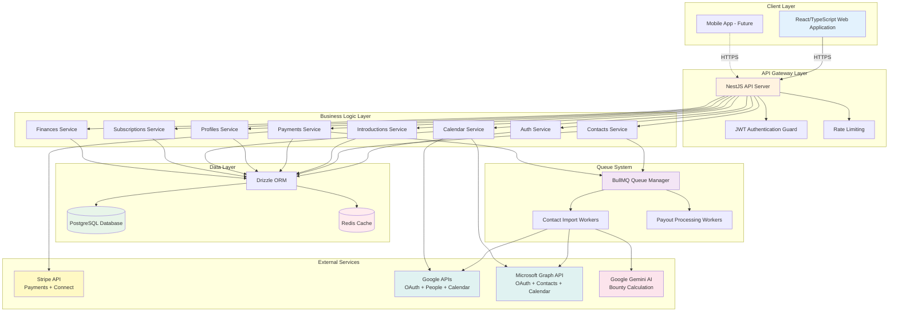
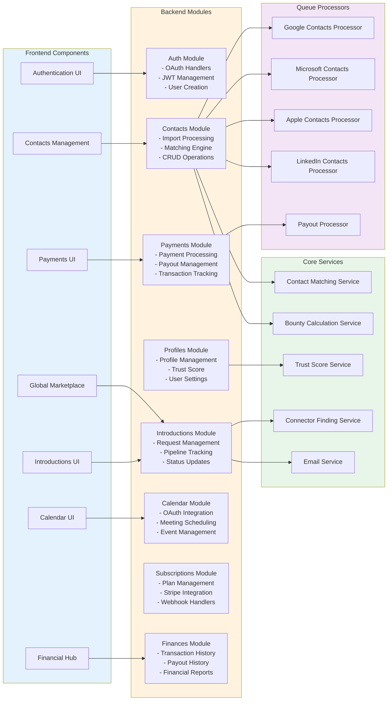
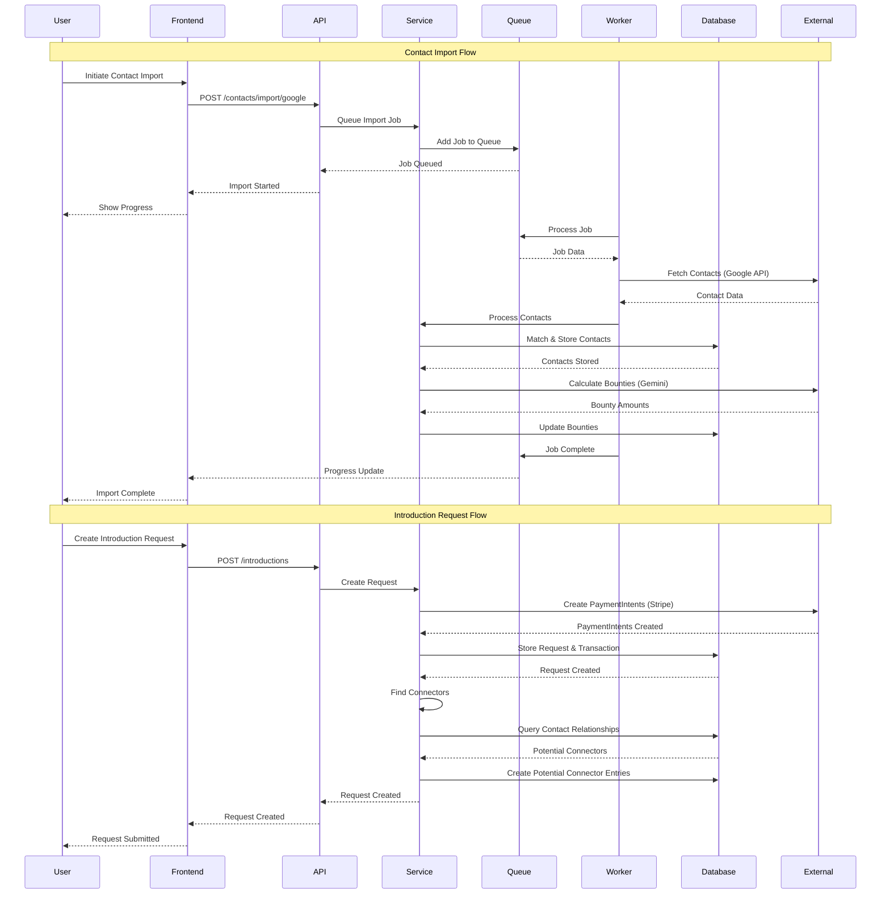
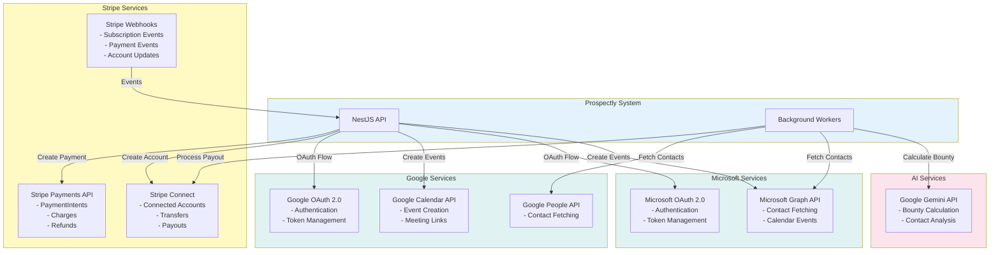
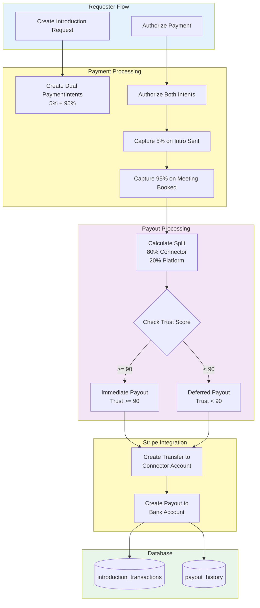

# Prospectly System Architecture

This document provides a comprehensive overview of the Prospectly system architecture, including component diagrams, technology stack, and system interactions.

## Table of Contents

1. [High-Level Architecture](#1-high-level-architecture)
2. [System Components](#2-system-components)
3. [Architecture Layers](#3-architecture-layers)
4. [Data Flow Architecture](#4-data-flow-architecture)
5. [External Services Integration](#5-external-services-integration)
6. [Queue System Architecture](#6-queue-system-architecture)
7. [Payment Processing Architecture](#7-payment-processing-architecture)

---

## 1. High-Level Architecture

Overall system architecture showing all major components and their relationships.



---

## 2. System Components

Detailed breakdown of all system components and their responsibilities.



---

## 3. Architecture Layers

Layered architecture showing separation of concerns.

```mermaid
graph TD
    subgraph Presentation["Presentation Layer"]
        ReactComponents[React Components]
        StateManagement[State Management<br/>React Query / Context]
        UIComponents[UI Component Library]
    end
    
    subgraph API["API Gateway Layer"]
        RESTControllers[REST Controllers]
        RequestValidation[Request Validation<br/>DTOs + Zod]
        ResponseFormatting[Response Formatting]
        ErrorHandling[Error Handling]
    end
    
    subgraph Business["Business Logic Layer"]
        DomainServices[Domain Services]
        BusinessRules[Business Rules]
        WorkflowOrchestration[Workflow Orchestration]
    end
    
    subgraph DataAccess["Data Access Layer"]
        ORM[Drizzle ORM]
        Repositories[Repository Pattern]
        QueryBuilders[Query Builders]
        Migrations[Database Migrations]
    end
    
    subgraph Infrastructure["Infrastructure Layer"]
        Database[(PostgreSQL)]
        Cache[(Redis)]
        QueueSystem[BullMQ]
        FileStorage[File Storage]
    end
    
    subgraph External["External Services Layer"]
        PaymentGateway[Stripe]
        OAuthProviders[OAuth Providers]
        AI Services[AI Services]
        EmailService[Email Service]
    end
    
    ReactComponents --> StateManagement
    StateManagement --> UIComponents
    UIComponents --> RESTControllers
    
    RESTControllers --> RequestValidation
    RequestValidation --> ResponseFormatting
    ResponseFormatting --> ErrorHandling
    ErrorHandling --> DomainServices
    
    DomainServices --> BusinessRules
    BusinessRules --> WorkflowOrchestration
    WorkflowOrchestration --> ORM
    
    ORM --> Repositories
    Repositories --> QueryBuilders
    QueryBuilders --> Migrations
    Migrations --> Database
    
    DomainServices --> Cache
    DomainServices --> QueueSystem
    DomainServices --> FileStorage
    
    DomainServices --> PaymentGateway
    DomainServices --> OAuthProviders
    DomainServices --> AI Services
    DomainServices --> EmailService
    
    style Presentation fill:#e3f2fd
    style API fill:#fff3e0
    style Business fill:#e8f5e9
    style DataAccess fill:#f3e5f5
    style Infrastructure fill:#ffebee
    style External fill:#fff9c4
```

---

## 4. Data Flow Architecture

How data flows through the system for key operations.



---

## 5. External Services Integration

How the system integrates with external services.



---

## 6. Queue System Architecture

Background job processing architecture using BullMQ.

```mermaid
graph TB
    subgraph Application["Application Layer"]
        Services[Business Services]
    end
    
    subgraph QueueLayer["Queue Layer"]
        QueueManager[BullMQ Queue Manager]
        GoogleContactsQueue[Google Contacts Queue]
        MicrosoftContactsQueue[Microsoft Contacts Queue]
        AppleContactsQueue[Apple Contacts Queue]
        LinkedInContactsQueue[LinkedIn Contacts Queue]
        PayoutQueue[Payout Queue]
    end
    
    subgraph WorkerLayer["Worker Layer"]
        GoogleWorker[Google Contacts Worker]
        MicrosoftWorker[Microsoft Contacts Worker]
        AppleWorker[Apple Contacts Worker]
        LinkedInWorker[LinkedIn Contacts Worker]
        PayoutWorker[Payout Worker]
    end
    
    subgraph Storage["Storage Layer"]
        Redis[(Redis<br/>Job Storage)]
        Database[(PostgreSQL<br/>Result Storage)]
    end
    
    Services -->|Add Job| QueueManager
    QueueManager --> GoogleContactsQueue
    QueueManager --> MicrosoftContactsQueue
    QueueManager --> AppleContactsQueue
    QueueManager --> LinkedInContactsQueue
    QueueManager --> PayoutQueue
    
    GoogleContactsQueue -->|Store| Redis
    MicrosoftContactsQueue -->|Store| Redis
    AppleContactsQueue -->|Store| Redis
    LinkedInContactsQueue -->|Store| Redis
    PayoutQueue -->|Store| Redis
    
    GoogleWorker -->|Poll| GoogleContactsQueue
    MicrosoftWorker -->|Poll| MicrosoftContactsQueue
    AppleWorker -->|Poll| AppleContactsQueue
    LinkedInWorker -->|Poll| LinkedInContactsQueue
    PayoutWorker -->|Poll| PayoutQueue
    
    GoogleWorker -->|Update Progress| Redis
    MicrosoftWorker -->|Update Progress| Redis
    AppleWorker -->|Update Progress| Redis
    LinkedInWorker -->|Update Progress| Redis
    PayoutWorker -->|Update Progress| Redis
    
    GoogleWorker -->|Save Results| Database
    MicrosoftWorker -->|Save Results| Database
    AppleWorker -->|Save Results| Database
    LinkedInWorker -->|Save Results| Database
    PayoutWorker -->|Save Results| Database
    
    style Application fill:#e3f2fd
    style QueueLayer fill:#f3e5f5
    style WorkerLayer fill:#e8f5e9
    style Storage fill:#ffebee
```



---

## 7. Payment Processing Architecture

Payment and payout processing architecture.



---

## Technology Stack

### Frontend
- **Framework**: React 18+ with TypeScript
- **State Management**: React Query, Context API
- **UI Library**: Custom components with Tailwind CSS
- **HTTP Client**: Axios with interceptors
- **Build Tool**: Vite

### Backend
- **Framework**: NestJS (Node.js)
- **Language**: TypeScript
- **ORM**: Drizzle ORM
- **Database**: PostgreSQL
- **Cache/Queue**: Redis with BullMQ
- **Authentication**: JWT with Passport

### External Services
- **Payments**: Stripe (Payments + Connect)
- **OAuth**: Google OAuth 2.0, Microsoft OAuth 2.0
- **APIs**: Google People API, Google Calendar API, Microsoft Graph API
- **AI**: Google Gemini API
- **Email**: SMTP/Email service

### Infrastructure
- **Database**: PostgreSQL with connection pooling
- **Cache**: Redis for sessions and job queues
- **File Storage**: Local/Cloud storage for uploads
- **Background Jobs**: BullMQ workers

---

## Security Architecture

```mermaid
graph TB
    subgraph SecurityLayers["Security Layers"]
        HTTPS[HTTPS/TLS Encryption]
        JWT[JWT Token Authentication]
        OAuth[OAuth 2.0 Flow]
        RateLimit[Rate Limiting]
        InputValidation[Input Validation]
        SQLInjection[SQL Injection Prevention]
        XSS[XSS Prevention]
        CSRF[CSRF Protection]
        Encryption[Data Encryption at Rest]
    end
    
    HTTPS --> JWT
    JWT --> OAuth
    OAuth --> RateLimit
    RateLimit --> InputValidation
    InputValidation --> SQLInjection
    SQLInjection --> XSS
    XSS --> CSRF
    CSRF --> Encryption
    
    style SecurityLayers fill:#ffebee
```



---

*Last Updated: January 2025*
