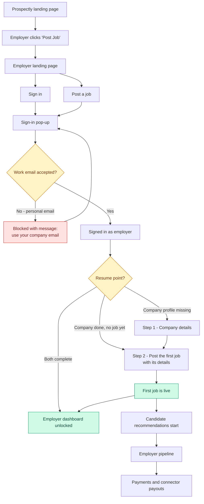
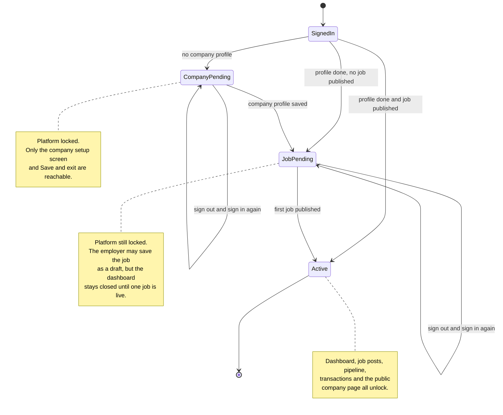
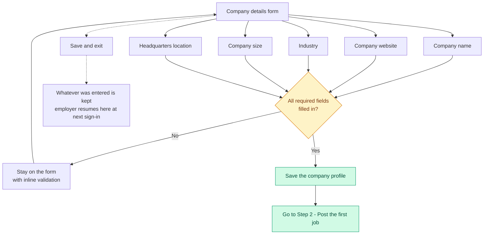
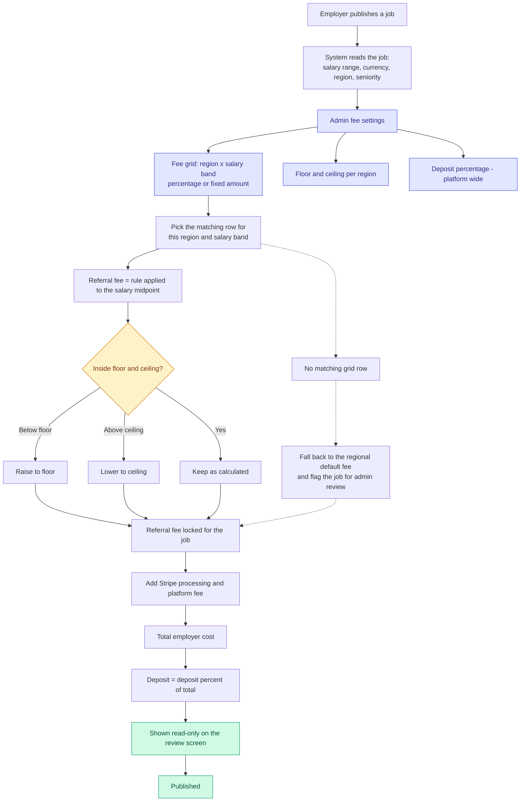
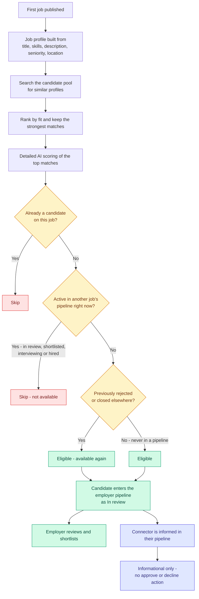
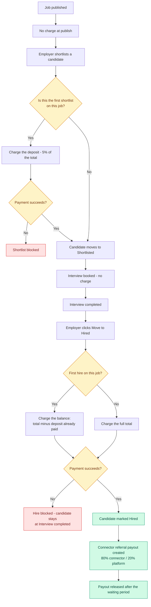

# Employer Onboarding & First Job Post — Flow Diagrams

**Audience:** Client review
**Status:** Proposed flow (for approval)
**Last updated:** 2 Sep 2026

Every diagram below is plain Mermaid — paste any block into mermaid.live, Notion, Confluence or GitHub and it renders as-is.

---

## 1. Master journey — landing page to first hire

---

## 2. The onboarding gate — where a returning employer lands

The employer cannot browse the platform until both steps are complete. Progress is saved at every step, so signing out and back in resumes exactly where they left off.

---

## 3. Step 1 — Company profile

A single short form. It is asked once per company, and it is the first of the two gates that keep the platform locked.

> No website scanning and no careers-page import in this release. Every field is entered by the employer.

---

## 4. Auto-generated referral fee (replaces the forced manual entry)

Today the employer must type a flat referral fee before they can publish. In the new flow the fee is derived on the server from admin settings, the salary range and the job's region. The employer sees the number, never types it.

### Example A — Senior Backend Engineer, North America

| Input | Value |
|---|---|
| Salary range on the job | 120,000 – 160,000 USD per year |
| Salary midpoint | 140,000 USD |
| Admin grid row | North America · 120k–180k band · **6% of midpoint** |
| Regional ceiling | 10,000 USD |

| Derived | Value |
|---|---|
| Referral fee | 6% of 140,000 = **8,400.00 USD** (inside the ceiling) |
| Stripe processing (2.9% + 0.30, grossed up) | 251.19 USD |
| Platform fee | 0.25 USD |
| **Total employer cost** | **8,651.44 USD** |
| Deposit at first shortlist (5%) | **432.57 USD** |
| Balance at hire | **8,218.87 USD** |
| Connector referral payout (80% of the fee) | 6,720.00 USD |
| Platform share (20%) | 1,680.00 USD |

### Example B — Support Specialist, smaller band

| Input | Value |
|---|---|
| Salary midpoint | 40,000 USD |
| Admin grid row | 5% of midpoint |
| Regional floor | 1,200 USD |

| Derived | Value |
|---|---|
| Referral fee | 5% of 40,000 = **2,000.00 USD** |
| Stripe processing | 60.05 USD |
| Platform fee | 0.25 USD |
| **Total employer cost** | **2,060.30 USD** |
| Deposit at first shortlist (5%) | **103.02 USD** |
| Balance at hire | **1,957.28 USD** |
| Connector referral payout (80%) | 1,600.00 USD |

> The employer never edits these numbers during the first post. Admins can override the fee on an individual job, and the fee remains editable after publish on open jobs.

---

## 5. Candidate recommendations after the first job goes live

Publishing the first job starts matching against the candidate pool. Everyone in that pool has already consented when they were added, so there is **no consent request and no connector approval step** — eligible matches go straight into the employer's pipeline, and the connector who owns the relationship is simply informed in their own pipeline.

**Availability rule in words:** a candidate is only recommended when they are **not currently moving through another employer's pipeline**. Candidates who were rejected or whose earlier process closed return to the available pool immediately.

**Connector's role here:** visibility, not gatekeeping. The match appears in the connector's pipeline so they can follow progress and see the referral payout attached to it, but nothing waits on them.

---

## 6. Payment capture — unchanged from today

The money model is exactly what is live today. Only the *source* of the fee changes (auto-derived instead of typed).

**Rejections cost nothing extra.** If the first shortlisted candidate is rejected, the deposit already paid is credited against whoever is hired first on that job. Every hire after the first is charged the full amount in one go.

---

## 7. One-page summary for the client

| Stage | Employer sees | System does |
|---|---|---|
| Landing | "Post Job" button | Routes to the employer landing page |
| Sign in | Google, Microsoft or work email | Rejects personal email domains; joins or creates the company workspace |
| Step 1 | A short company details form | Saves the company profile and unlocks Step 2 |
| Step 2 | Job details, skills, description with live preview | Builds the searchable job profile |
| Step 3 | Salary range with a recommended band | Salary is informational and drives the fee derivation |
| Step 4 | Engagement model — EOR, managed or direct | Optional and skippable; asked again at hire |
| Step 5 | Review and publish | Derives the referral fee, shows it read-only, publishes |
| After publish | Matched candidates, unlocked dashboard | Recommends available candidates only; starts the payment lifecycle |
